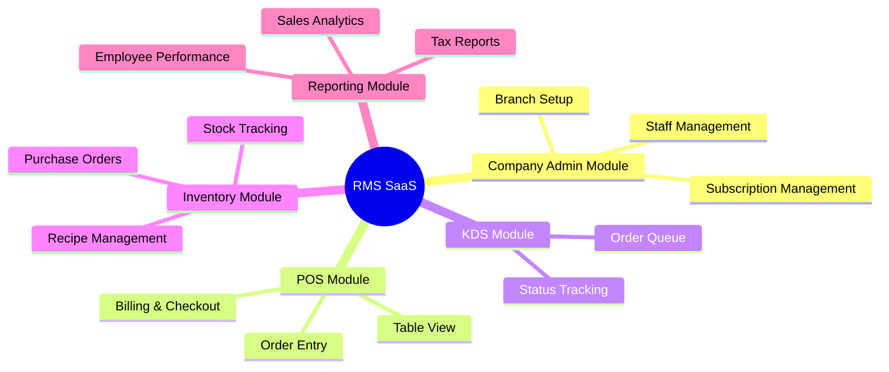
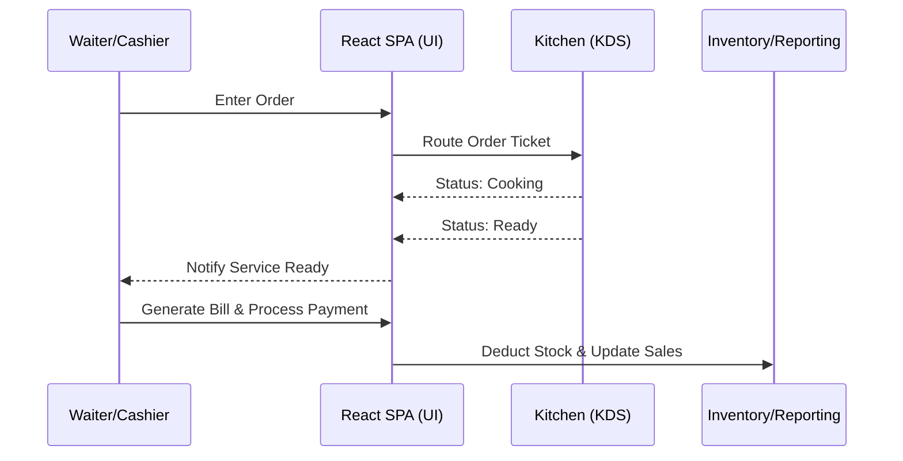
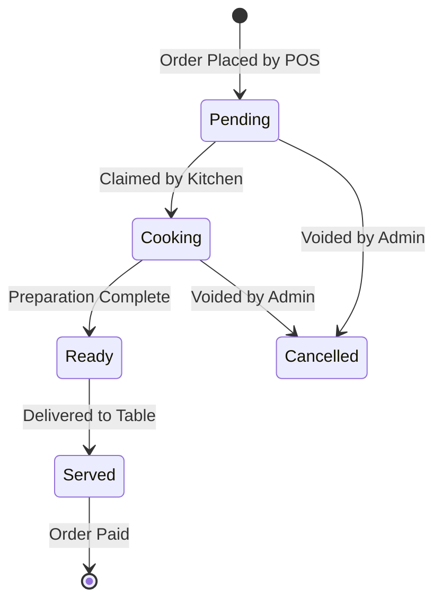
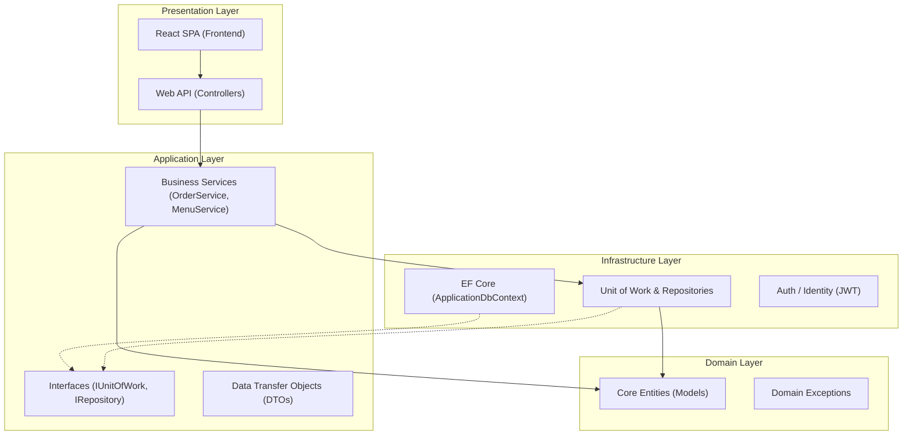
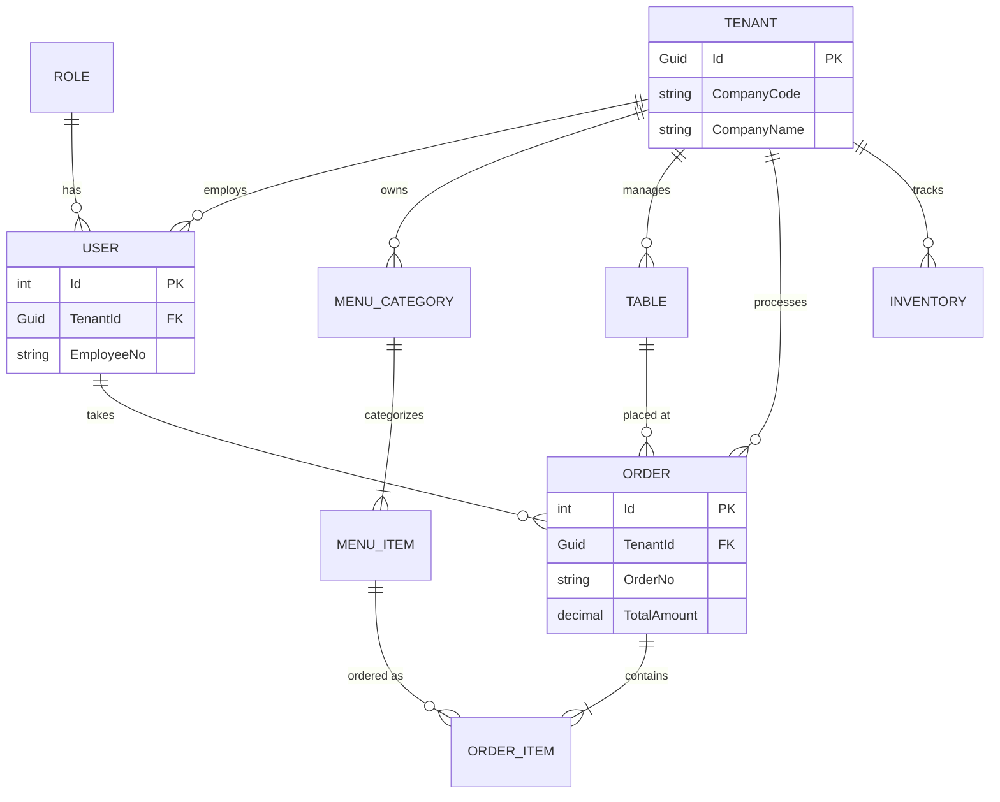
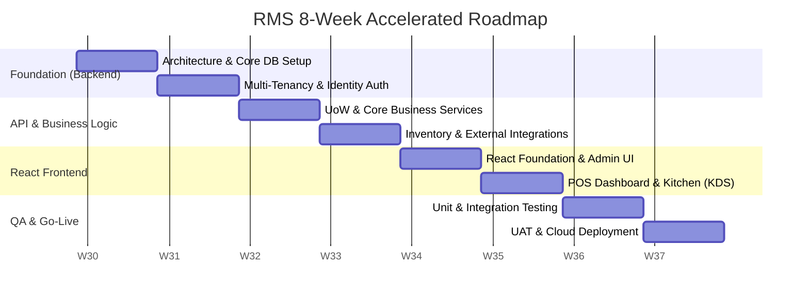

# Multi-Tenant Restaurant Management System (RMS)

## 1. Executive Summary
This document serves as the comprehensive A-to-Z blueprint and master documentation for the **Restaurant Management System (RMS)**. Designed to meet modern enterprise standards, this project is built to support a **Multi-Tenant (Multiple Company Support) SaaS model**, utilizing a highly scalable **Clean Architecture** built on **C# .NET Core**.

### Core Enhancements
- **Clean Architecture:** Strict separation of concerns (Domain, Application, Infrastructure, Presentation) ensuring a highly testable and maintainable codebase.
- **Multi-Tenant System:** A single instance of the software serves multiple companies/restaurants independently, using `TenantId` (CompanyId) isolation at the database level.
- **Modern SPA Frontend:** Utilizing **React** as the frontend framework. React's component-driven architecture paired with .NET Core Web APIs has become the modern industry standard for rapidly delivering high-performance, dynamic user interfaces.

---

## 2. Requirements Analysis

### 2.1 Functional Requirements
- **User Management:** Secure authentication and role-based authorization (Admin, Manager, Cashier, Waiter, Kitchen Staff).
- **Point of Sale (POS):** Order entry, split billing, discount/coupon application, custom tipping, and receipt generation.
- **Inventory Management:** Real-time stock tracking, low stock alerts, supplier management, and purchase order generation.
- **Menu Management:** Dynamic management of categories, items, variations (sizes/addons), pricing, and availability status.
- **Table Management:** Visual floor plan with real-time table status (Available, Occupied, Reserved) and reservation management.
- **Kitchen Display System (KDS):** Digital order routing, ticket timers, and status updates (Pending, Cooking, Ready).
- **Reporting & Analytics:** Comprehensive dashboards for sales reports, tax reports, inventory consumption, and employee shift performance.
- **Shift & Cash Management:** Employee clock-in/out for payroll tracking, cash register float management, and end-of-day Z-Reports.
- **CRM & Loyalty Programs:** Customer profiles tracking order history, preferences, and a points-based loyalty reward system.
- **Third-Party Integrations:** API gateway for automatic synchronization of orders from delivery platforms (e.g., UberEats, DoorDash).

### 2.2 Non-Functional Requirements
- **Performance:** High responsiveness with fast transaction processing, especially in the POS module during peak hours.
- **Security:** Data encryption at rest and in transit, strict role-based access control (RBAC), and PCI-DSS compliance for payment gateway integration.
- **Reliability:** Automated daily data backups and robust error handling.
- **Hardware Integration:** Support for standard POS hardware including ESC/POS receipt printers, cash drawer kicks, barcode scanners, and EMV payment terminals.
- **Scalability:** Modular architecture designed to scale seamlessly as new restaurant tenants subscribe to the platform.

---

## 3. Module & Sub-Module Breakdown

The system is logically divided into distinct modules to handle different aspects of the restaurant business.

### 3.1 High-Level Module Visualization



### 3.2 Detailed Sub-Module Breakdown
#### 1. Tenant/Company Admin Module
- **Super Admin Sub-module:** Manage SaaS subscriptions, onboard new companies, system-wide metrics.
- **Company Profile Sub-module:** Configure tax rates, currency, receipt layouts, and business hours.
- **User & Role Sub-module:** Manage employees, assign roles (Cashier, Waiter, Kitchen), and configure RBAC.

#### 2. Point of Sale (POS) Module
- **Order Entry Sub-module:** Touch-friendly interface for item selection, applying variations/addons, and split billing.
- **Table Management Sub-module:** Visual floor plan showing real-time table statuses.
- **Payment Sub-module:** Process cash, card, and mobile payments. Generate digital or printed receipts.

#### 3. Kitchen Display System (KDS) Module
- **Ticket Routing Sub-module:** Automatically route food items to kitchen screens and beverages to the bar.
- **Status Tracking Sub-module:** Mark items as *Pending*, *Cooking*, or *Ready*.
- **Service Alerts:** Notify waitstaff via the POS or mobile devices when an order is ready for pickup.

#### 4. Inventory & Menu Management Module
- **Menu Engineering Sub-module:** Create categories, items, and dynamic pricing.
- **Stock Tracking Sub-module:** Real-time deduction of inventory based on sold items (using mapped recipes/ingredients).
- **Supplier & PO Sub-module:** Manage supplier details and generate Purchase Orders.

#### 5. Analytics & Reporting Module
- **Sales Dashboard:** Visual charts for daily/weekly/monthly revenue and top-selling items.
- **Operational Reports:** Inventory consumption reports, Z-Reports (End of Day), and tax summaries.

---

## 4. System Workflows & State Diagrams

### 4.1 Standard Workflow: Order to Payment


### 4.2 Order Item Lifecycle (State Diagram)
To ensure the Kitchen Display System (KDS) and POS are perfectly synced, every order item follows a strict state machine.



---

## 5. System Architecture (Clean Architecture)

The system is designed using the **Clean Architecture** pattern in **C# .NET Core**. To maximize development speed and adhere to traditional enterprise standards, we utilize the **Service Pattern** inside the Application Layer, supported by the **Repository & Unit of Work (UoW) Patterns** in the Infrastructure layer. 

For the frontend, we use a **React SPA** architecture, communicating with the .NET Core API via secured REST endpoints.

### 5.1 Architecture Flow


### 5.2 Visual Studio Solution Folder Structure
```text
RestaurantManagementSystem.sln
│
├── 1. RMS.Domain (Class Library)
│   ├── Common/              # Base Entity classes
│   ├── Entities/            # Tenant, User, Order, MenuItem, Table
│   ├── Enums/               # OrderStatus, RoleType
│   └── Exceptions/          # Domain-specific errors
│
├── 2. RMS.Application (Class Library)
│   ├── Interfaces/          # IUnitOfWork, IGenericRepository, ITenantService
│   ├── DTOs/                # OrderResponseDto, CreateUserRequestDto
│   └── Services/            # Business Logic (OrderService, MenuService)
│
├── 3. RMS.Infrastructure (Class Library)
│   ├── Persistence/         # ApplicationDbContext, Migrations
│   │   └── Configurations/  # FluentAPI Entity configurations
│   ├── Repositories/        # GenericRepository, UnitOfWork implementation
│   ├── Services/            # TenantResolutionService (Reads TenantId from JWT)
│   └── Authentication/      # JwtTokenGenerator setup
│
└── 4. RMS.Api (ASP.NET Core Web API - Startup)
    ├── Controllers/         # API Endpoints (e.g. OrdersController)
    ├── Middlewares/         # Global Exception Handling, Tenant Middleware
    └── Program.cs           # Dependency Injection setup
```

---

## 6. Multi-Tenant Database Design

To support multiple companies from a single database, we use **Database-Level Multi-Tenancy** (Row-Level Security). Every core table includes a `TenantId` column, and we use integer primary keys with human-readable tracking codes.

### 6.1 Database Entity Relationship (ER) Diagram



### 6.2 Data Dictionary (Core Tables)

| Table Name | Description | Key Columns |
| :--- | :--- | :--- |
| **Tenants** | The root table identifying different restaurant businesses. | `Id` (GUID, PK), `CompanyCode`, `CompanyName` |
| **Users** | Employees belonging to a specific tenant. | `Id` (INT, PK), `TenantId` (FK), `EmployeeNo`, `RoleId` |
| **MenuItems** | Food and beverages sold by a tenant. | `Id` (INT, PK), `TenantId` (FK), `ItemCode`, `BasePrice` |
| **Orders** | Customer orders placed at the restaurant. | `Id` (INT, PK), `TenantId` (FK), `OrderNo`, `TableId` (FK) |

### 6.3 Implementation: EF Core Global Query Filters
To ensure data isolation so Restaurant A never sees Restaurant B's data, we apply a global filter in the `ApplicationDbContext`. The `TenantId` is extracted from the user's JWT token via the `ITenantService`.
```csharp
protected override void OnModelCreating(ModelBuilder builder)
{
    // Automatically filter all queries so users only see their company's data
    builder.Entity<Order>().HasQueryFilter(e => e.TenantId == _tenantService.TenantId);
    builder.Entity<MenuItem>().HasQueryFilter(e => e.TenantId == _tenantService.TenantId);
}
```

---

## 7. Technology Stack Summary

| Layer/Component | Technology |
| :--- | :--- |
| **Frontend UI** | React |
| **Backend Framework** | C# .NET Core Web API |
| **Architecture** | Clean Architecture (Service Pattern, Unit of Work, Repository Pattern) |
| **Database** | Microsoft SQL Server |
| **ORM** | Entity Framework Core (EF Core) |
| **Authentication** | ASP.NET Core Identity & JWT |
| **Multi-Tenancy** | Database-level (TenantId column + EF Core Query Filters) |

---

## 8. Fast-Track Development Timeline (8-Week Agile Plan)

Since the architecture and database schema have been thoroughly pre-planned and approved, the standard 12-week timeline can be compressed into a highly efficient **8-week execution plan**.

### 8.1 Agile Gantt Chart


### 8.2 Detailed Week-by-Week Breakdown

**Week 1: Architecture & Database Foundation**
- Scaffold the 4 Clean Architecture projects (Domain, Application, Infrastructure, Web API).
- Define all C# Entities (using Integers for PKs, GUID for Tenant).
- Setup `ApplicationDbContext` and run EF Core migrations to SQL Server.

**Week 2: Multi-Tenancy & Authentication**
- Implement ASP.NET Core Identity and generate JWT Tokens.
- Implement `TenantResolutionService` and apply EF Core Global Query Filters for data isolation.

**Week 3: Core Business Services (The Engine)**
- Implement `IGenericRepository` and `UnitOfWork`.
- Build the core POS Order processing logic (Create Order, Apply Taxes/Discounts).

**Week 4: Integrations & Reporting**
- Build Inventory deduction logic inside `InventoryService`.
- Create webhooks for third-party food delivery APIs (UberEats, DoorDash).

**Week 5: React Frontend - Foundation**
- Initialize the React project (Vite or Next.js).
- Build the Auth context, Login Component, and HTTP Axios Interceptors to handle JWTs.
- Develop the Admin Dashboard (User & Menu Management).

**Week 6: React Frontend - POS & KDS**
- Build the dynamic Point of Sale UI components (Menu Grid, Active Ticket).
- Develop the Kanban-style Kitchen Display System (KDS) for real-time ticket tracking.

**Week 7: Testing & Quality Assurance**
- Write automated Unit Tests for Domain logic and Business Services.
- Conduct End-to-End API Testing to guarantee cross-tenant data safety.

**Week 8: Deployment & UAT**
- Deploy the ASP.NET Core Web API and SQL Server to Azure.
- Host the compiled React SPA on Vercel or Azure Static Web Apps.
- Conduct User Acceptance Testing (UAT) and project hand-off.
