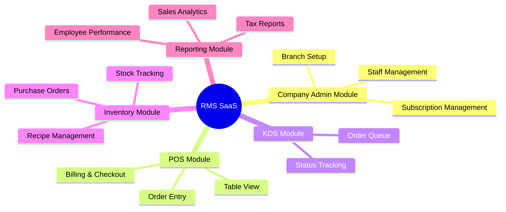
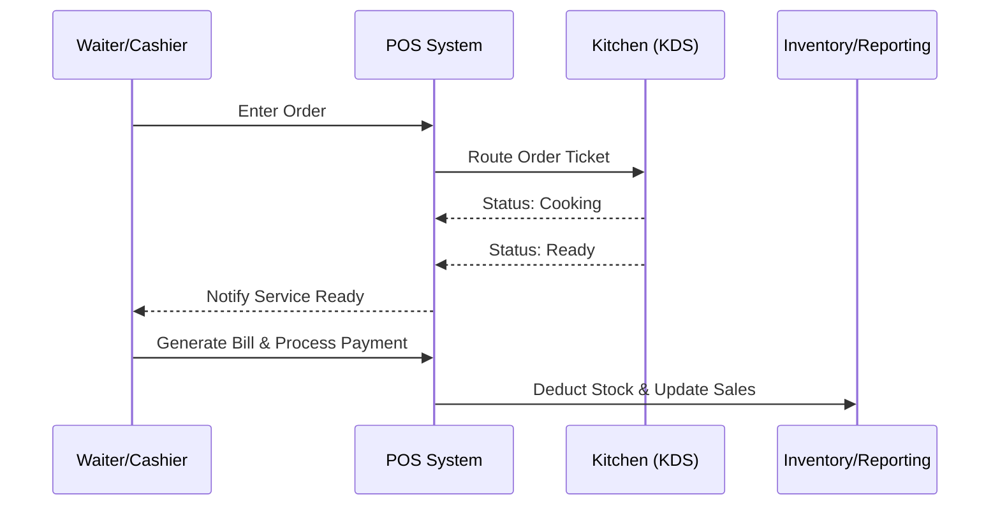
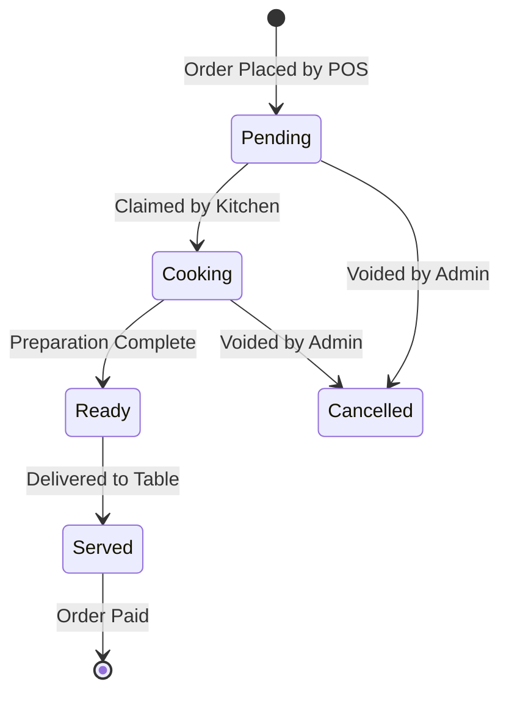
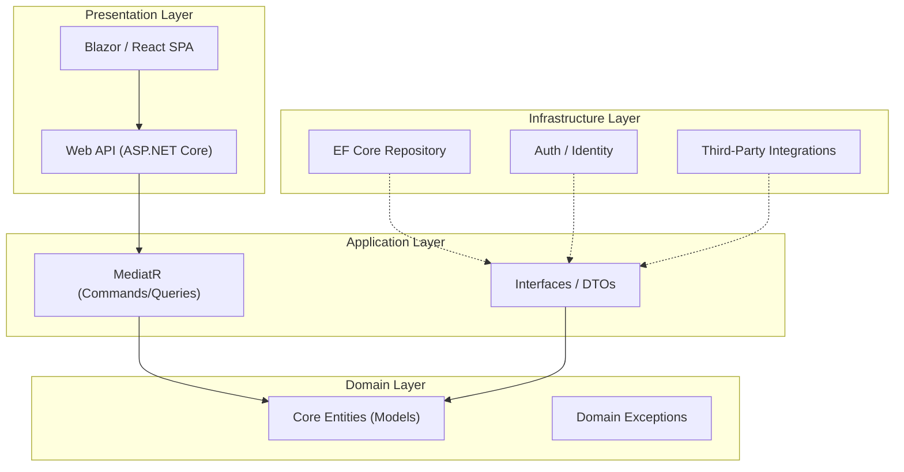
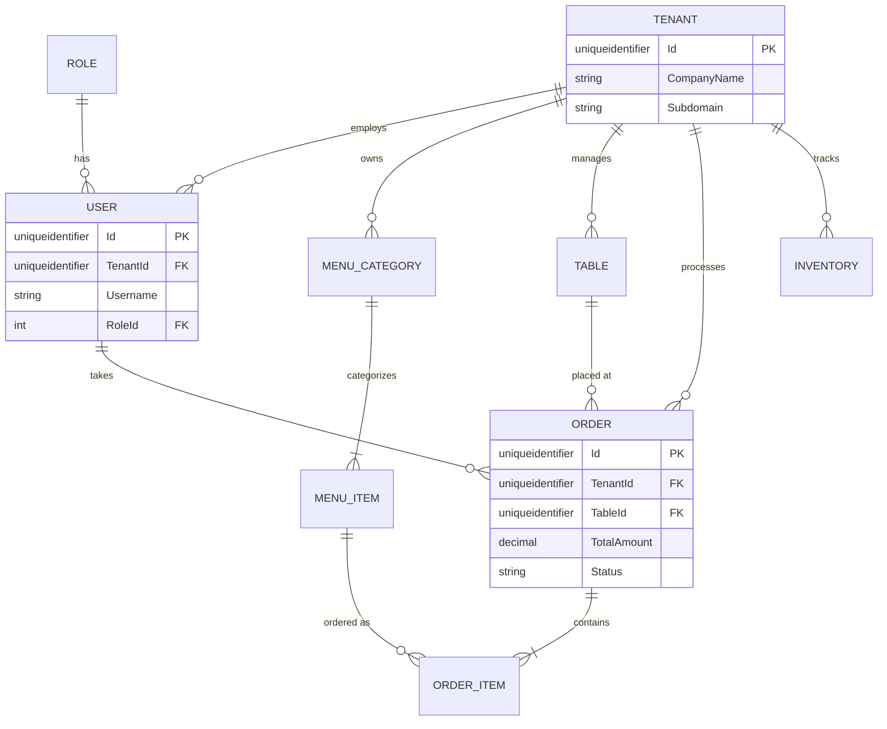
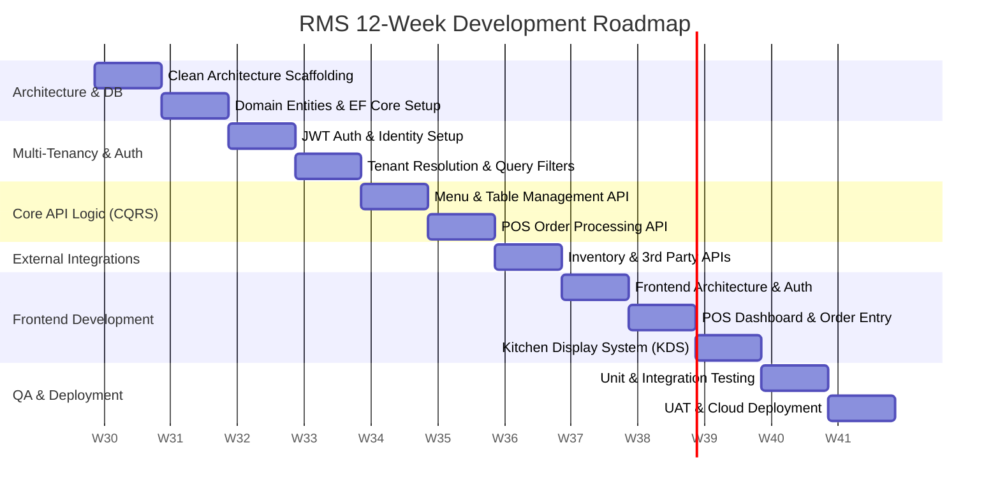

# Multi-Tenant Restaurant Management System (RMS)

## 1. Executive Summary
This document serves as the comprehensive A-to-Z blueprint and master documentation for the **Restaurant Management System (RMS)**. Designed to meet modern enterprise standards, this project is built to support a **Multi-Tenant (Multiple Company Support) SaaS model**, utilizing a highly scalable **Clean Architecture** built on **C# .NET Core**.

### Core Enhancements
- **Clean Architecture:** Strict separation of concerns (Domain, Application, Infrastructure, Presentation) ensuring a highly testable and maintainable codebase.
- **Multi-Tenant System:** A single instance of the software serves multiple companies/restaurants independently, using `TenantId` (CompanyId) isolation at the database level.
- **Offline-First POS:** Robust Point of Sale capabilities designed to handle high transaction volumes without interruption.

---

## 2. Requirements Analysis

### 2.1 Functional Requirements
- **User Management:** Secure authentication and role-based authorization (Admin, Manager, Cashier, Waiter, Kitchen Staff).
- **Point of Sale (POS):** Order entry, split billing, discount/coupon application, custom tipping, and receipt generation.
- **Inventory Management:** Real-time stock tracking, low stock alerts, supplier management, and purchase order generation.
- **Menu Management:** Dynamic management of categories, items, variations (sizes/addons), pricing, and availability status.
- **Table Management:** Visual floor plan with real-time table status (Available, Occupied, Reserved) and reservation management.
- **Kitchen Display System (KDS):** Digital order routing, ticket timers, and status updates (Pending, Cooking, Ready).
- **Reporting & Analytics:** Comprehensive dashboards for sales reports, tax reports, inventory consumption, and employee shift performance.
- **Shift & Cash Management:** Employee clock-in/out for payroll tracking, cash register float management, and end-of-day Z-Reports.
- **CRM & Loyalty Programs:** Customer profiles tracking order history, preferences, and a points-based loyalty reward system.
- **Third-Party Integrations:** API gateway for automatic synchronization of orders from delivery platforms (e.g., UberEats, DoorDash).

### 2.2 Non-Functional Requirements
- **Performance:** High responsiveness with fast transaction processing, especially in the POS module during peak hours.
- **Security:** Data encryption at rest and in transit, strict role-based access control (RBAC), and PCI-DSS compliance for payment gateway integration.
- **Reliability:** Automated daily data backups and robust error handling.
- **Hardware Integration:** Support for standard POS hardware including ESC/POS receipt printers, cash drawer kicks, barcode scanners, and EMV payment terminals.
- **Scalability:** Modular architecture designed to scale seamlessly as new restaurant tenants subscribe to the platform.

---

## 3. Module & Sub-Module Breakdown

The system is logically divided into distinct modules to handle different aspects of the restaurant business.

### 3.1 High-Level Module Visualization



### 3.2 Detailed Sub-Module Breakdown
#### 1. Tenant/Company Admin Module
- **Super Admin Sub-module:** Manage SaaS subscriptions, onboard new companies, system-wide metrics.
- **Company Profile Sub-module:** Configure tax rates, currency, receipt layouts, and business hours.
- **User & Role Sub-module:** Manage employees, assign roles (Cashier, Waiter, Kitchen), and configure RBAC.

#### 2. Point of Sale (POS) Module
- **Order Entry Sub-module:** Touch-friendly interface for item selection, applying variations/addons, and split billing.
- **Table Management Sub-module:** Visual floor plan showing real-time table statuses.
- **Payment Sub-module:** Process cash, card, and mobile payments. Generate digital or printed receipts.

#### 3. Kitchen Display System (KDS) Module
- **Ticket Routing Sub-module:** Automatically route food items to kitchen screens and beverages to the bar.
- **Status Tracking Sub-module:** Mark items as *Pending*, *Cooking*, or *Ready*.
- **Service Alerts:** Notify waitstaff via the POS or mobile devices when an order is ready for pickup.

#### 4. Inventory & Menu Management Module
- **Menu Engineering Sub-module:** Create categories, items, and dynamic pricing.
- **Stock Tracking Sub-module:** Real-time deduction of inventory based on sold items (using mapped recipes/ingredients).
- **Supplier & PO Sub-module:** Manage supplier details and generate Purchase Orders.

#### 5. Analytics & Reporting Module
- **Sales Dashboard:** Visual charts for daily/weekly/monthly revenue and top-selling items.
- **Operational Reports:** Inventory consumption reports, Z-Reports (End of Day), and tax summaries.

---

## 4. System Workflows & State Diagrams

### 4.1 Standard Workflow: Order to Payment


### 4.2 Order Item Lifecycle (State Diagram)
To ensure the Kitchen Display System (KDS) and POS are perfectly synced, every order item follows a strict state machine.



---

## 5. System Architecture (Clean Architecture)

The system is designed using the **Clean Architecture** pattern in **C# .NET Core**. Dependencies flow inwards toward the Domain layer, ensuring business logic is completely isolated from UI frameworks or database technologies.

### 5.1 Architecture Flow


### 5.2 Visual Studio Solution Folder Structure
```text
RestaurantManagementSystem.sln
│
├── 1. RMS.Domain (Class Library)
│   ├── Common/              # Base Entity classes
│   ├── Entities/            # Tenant, User, Order, MenuItem, Table
│   ├── Enums/               # OrderStatus, RoleType
│   └── Exceptions/          # Domain-specific errors
│
├── 2. RMS.Application (Class Library)
│   ├── Interfaces/          # IApplicationDbContext, ITenantService
│   ├── DTOs/                # OrderResponseDto, CreateUserRequestDto
│   ├── Features/            # CQRS Pattern (Organized by feature)
│   │   ├── Orders/          # Commands (CreateOrder) & Queries
│   │   └── Menu/            # Commands (AddMenuItem)
│   └── Behaviors/           # MediatR validation pipeline behaviors
│
├── 3. RMS.Infrastructure (Class Library)
│   ├── Persistence/         # ApplicationDbContext, Migrations
│   │   └── Configurations/  # FluentAPI Entity configurations
│   ├── Services/            # TenantResolutionService (Reads TenantId from JWT)
│   └── Authentication/      # JwtTokenGenerator setup
│
└── 4. RMS.Api (Web API Project - Startup)
    ├── Controllers/         # API Endpoints (e.g. OrdersController)
    ├── Middlewares/         # Global Exception Handling, Tenant Middleware
    └── Program.cs           # Dependency Injection setup
```

---

## 6. Multi-Tenant Database Design

To support multiple companies from a single database, we use **Database-Level Multi-Tenancy** (Row-Level Security). Every core table includes a `TenantId` (or `CompanyId`) column.

### 6.1 Database Entity Relationship (ER) Diagram



### 6.2 Data Dictionary (Core Tables)

| Table Name | Description | Key Columns |
| :--- | :--- | :--- |
| **Tenants** | The root table identifying different restaurant businesses. | `Id` (PK), `CompanyName`, `Subdomain`, `CreatedAt` |
| **Users** | Employees belonging to a specific tenant. | `Id` (PK), `TenantId` (FK), `Username`, `PasswordHash`, `RoleId` |
| **MenuItems** | Food and beverages sold by a tenant. | `Id` (PK), `TenantId` (FK), `Name`, `Price`, `IsAvailable` |
| **Orders** | Customer orders placed at the restaurant. | `Id` (PK), `TenantId` (FK), `TableId` (FK), `UserId` (FK), `TotalAmount`, `Status` |

### 6.3 Implementation: EF Core Global Query Filters
To ensure data isolation so Restaurant A never sees Restaurant B's data, we apply a global filter in the `ApplicationDbContext`. The `TenantId` is extracted from the user's JWT token via the `ITenantService`.
```csharp
protected override void OnModelCreating(ModelBuilder builder)
{
    // Automatically filter all queries so users only see their company's data
    builder.Entity<Order>().HasQueryFilter(e => e.TenantId == _tenantService.TenantId);
    builder.Entity<MenuItem>().HasQueryFilter(e => e.TenantId == _tenantService.TenantId);
}
```

---

## 7. Technology Stack Summary

| Layer/Component | Technology |
| :--- | :--- |
| **Backend Framework** | C# .NET Core (Web API) |
| **Architecture** | Clean Architecture, CQRS (MediatR) |
| **Database** | Microsoft SQL Server |
| **ORM** | Entity Framework Core (EF Core) |
| **Authentication** | ASP.NET Core Identity & JWT |
| **Multi-Tenancy** | Database-level (TenantId column + EF Core Query Filters) |
| **Frontend Options** | Blazor WebAssembly / React.js / WPF |

---

## 8. Development Timeline (12-Week Agile Plan)

The project will be developed over a 12-week timeframe. Below is the exact week-by-week implementation roadmap.

### 8.1 Agile Gantt Chart


### 8.2 Detailed Week-by-Week Breakdown

**Week 1: Architecture Foundation**
- Set up the 4 Clean Architecture projects (Domain, Application, Infrastructure, API).
- Configure Dependency Injection and MediatR pipelines.

**Week 2: Database Design**
- Define all Core Entities with `TenantId`.
- Setup Entity Framework Core `ApplicationDbContext` and run initial migrations to SQL Server.

**Week 3: Identity & Authentication**
- Implement ASP.NET Core Identity.
- Build the Login API endpoint to generate JWT Tokens containing the user's `TenantId` and Role.

**Week 4: Multi-Tenancy Implementation**
- Implement `TenantResolutionService` (reads JWT from API Headers).
- Apply EF Core Global Query Filters so all database queries automatically isolate tenant data.

**Week 5: Menu & Table Management (API)**
- Build CQRS Commands/Queries for Categories and Menu Items.
- Build CQRS Commands/Queries for Table configurations and status.

**Week 6: The Order Engine (API)**
- Develop the core POS Order processing logic (Create Order, Link Order Items, Apply Taxes/Discounts, Calculate Subtotals).
- Develop KDS endpoints for updating order statuses.

**Week 7: Integrations & Background Services**
- Build Inventory deduction logic (deducting stock when items are ordered).
- Set up background worker services for potential third-party delivery APIs (UberEats dummy webhook).

**Week 8: Frontend - Foundation**
- Initialize the Frontend Project (Blazor/React).
- Build the Login Screen, JWT storage, and HTTP Client Interceptors for the Tenant header.

**Week 9: Frontend - POS Dashboard**
- Develop the Point of Sale UI (Grid of menu items, Active Order Ticket panel).
- Connect POS UI to the Order Engine API.

**Week 10: Frontend - KDS & Admin**
- Develop the Kanban-style Kitchen Display System for live ticket tracking.
- Develop basic Admin reporting dashboards.

**Week 11: Testing & Quality Assurance**
- Write automated Unit Tests for Domain logic.
- Conduct Integration Testing on API endpoints (ensuring Multi-tenant data leakage does not occur).

**Week 12: Deployment & UAT**
- Deploy Backend API and SQL Server to Azure / AWS.
- Host the Frontend.
- Conduct User Acceptance Testing (UAT) and final bug fixes.
