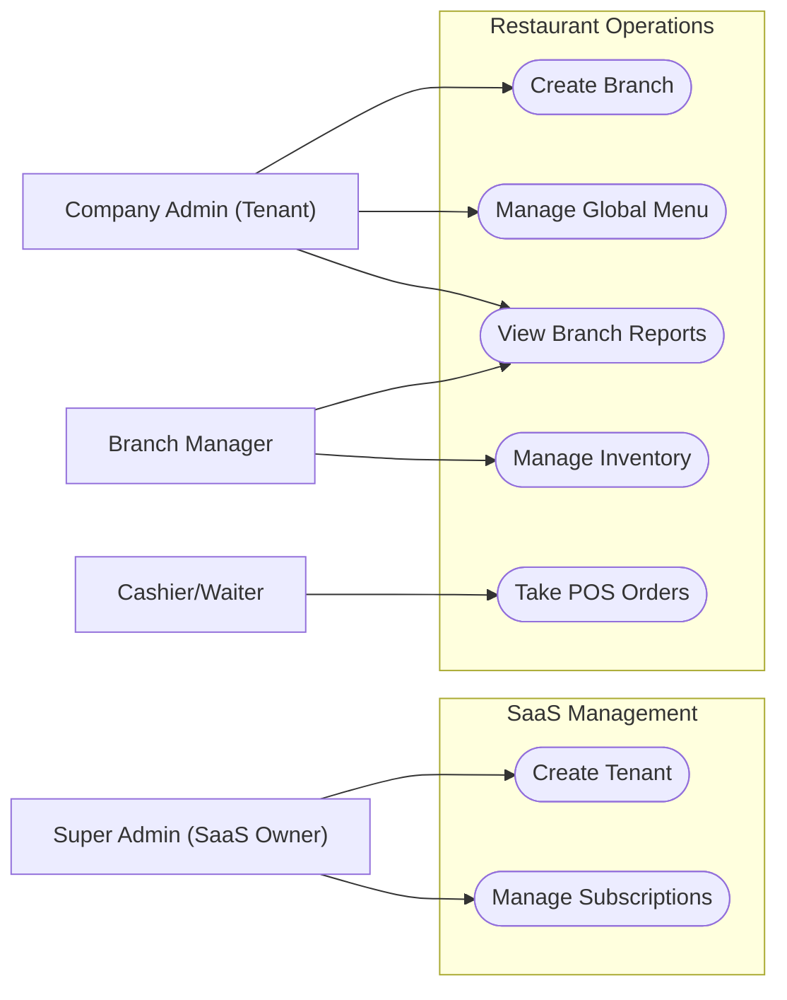
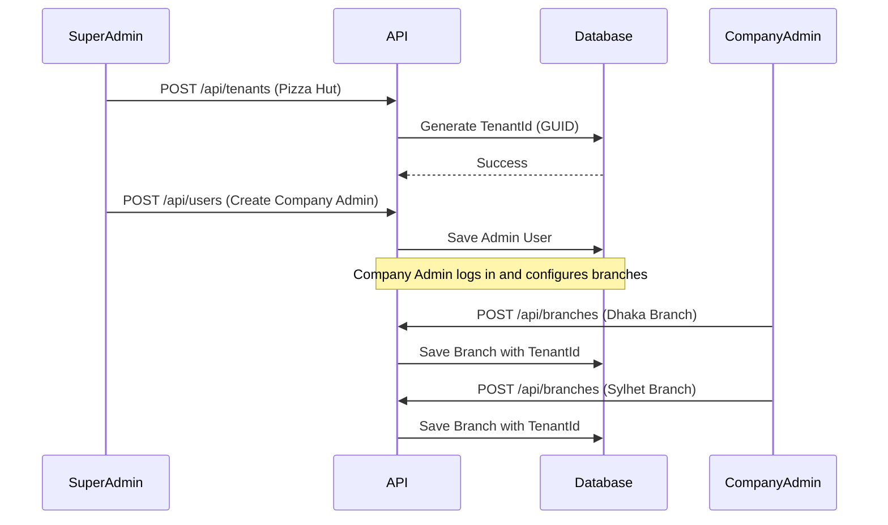
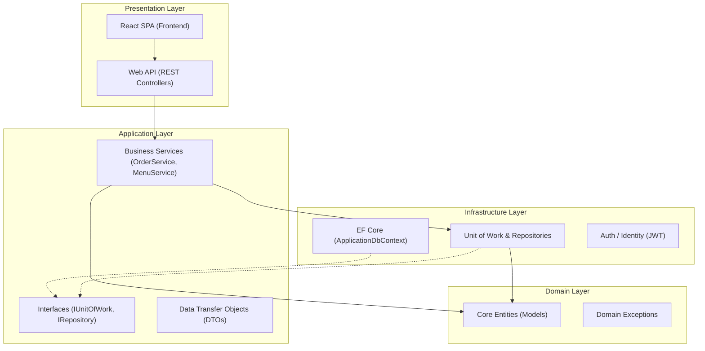
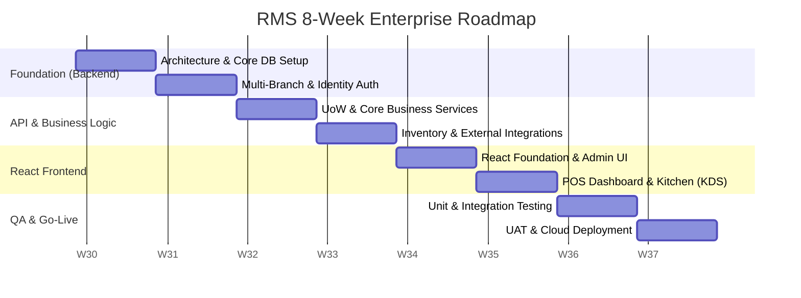

# Multi-Tenant & Multi-Branch Restaurant Management System (RMS)
**Enterprise SaaS Specification - Version 2.0**

## 1. Executive Summary
This document serves as the comprehensive A-to-Z blueprint for the **Restaurant Management System (RMS)**. Designed for modern enterprise scaling, this project is built to support a **Multi-Tenant (Multiple Company) & Multi-Branch SaaS model**. It utilizes a highly scalable **Clean Architecture** built on **C# .NET Core** and a dynamic **React SPA** frontend.

### Core Enhancements (Version 2)
- **Multi-Branch Hierarchy:** Supports global Companies (Tenants) that operate multiple distinct physical locations (Branches).
- **Clean Architecture:** Strict separation of concerns using the Service Pattern and Unit of Work.
- **Enterprise RBAC:** Strict Role-Based Access Control tied to a detailed permission matrix.

---

## 2. Requirements & Use Case Analysis

### 2.1 Functional Requirements
- **User Management:** Secure authentication and role-based authorization.
- **Point of Sale (POS):** Order entry, split billing, discount/coupon application, and receipt generation.
- **Inventory Management:** Real-time stock tracking per branch, supplier management, and purchase orders.
- **Menu Management:** Global menu management pushed down to individual branches.
- **Kitchen Display System (KDS):** Digital order routing and status updates.

### 2.2 System Actors & Use Case Diagrams



---

## 3. Tenant Onboarding Workflow (Sequence Diagram)
To understand how the Multi-Branch architecture is initialized, below is the flow of onboarding a brand new restaurant chain into the SaaS platform.



---

## 4. Multi-Tenant & Multi-Branch Database Architecture

To support massive scalability, we employ a hierarchical data model. A `Tenant` (Company) uses a secure **GUID** to prevent ID guessing. Physical locations are represented as `Branches` and use highly performant **Integers (INT)** for rapid SQL indexing.

```text
Tenant (e.g., Pizza Hut) - [GUID: 550e8400-e29b-41d4-a716-446655440000]
 │
 ├─ Branch (Dhaka) - [ID: 1]
 │    ├─ Orders (BranchId: 1)
 │    ├─ Employees (BranchId: 1)
 │    └─ Inventory (BranchId: 1)
 │
 └─ Branch (Sylhet) - [ID: 2]
      ├─ Orders (BranchId: 2)
      ├─ Employees (BranchId: 2)
      └─ Inventory (BranchId: 2)
```

*(Note: See the accompanying `RMS_Full_Database_Schema.md` file for the exact 20+ table data dictionary and ERD).*

---

## 5. Security & Permission Matrix

Access is strictly controlled via JWT tokens. The payload includes both the `TenantId` and the `BranchId` to ensure employees cannot view or manipulate data at other branches.

| Feature / Action | Company Admin | Branch Manager | Cashier | Waiter | Kitchen |
| :--- | :---: | :---: | :---: | :---: | :---: |
| **Manage Subscriptions** | ✅ | ❌ | ❌ | ❌ | ❌ |
| **Create New Branches** | ✅ | ❌ | ❌ | ❌ | ❌ |
| **Edit Global Menu** | ✅ | ❌ | ❌ | ❌ | ❌ |
| **Manage Inventory** | ✅ | ✅ | ❌ | ❌ | ❌ |
| **View End-of-Day Z-Report** | ✅ | ✅ | ❌ | ❌ | ❌ |
| **Void/Refund Order** | ✅ | ✅ | ❌ | ❌ | ❌ |
| **Process Payment** | ✅ | ✅ | ✅ | ❌ | ❌ |
| **Create POS Order** | ✅ | ✅ | ✅ | ✅ | ❌ |
| **Update KDS Status** | ❌ | ❌ | ❌ | ❌ | ✅ |

---

## 6. System Architecture (Clean Architecture)



---

## 7. REST API Design (Endpoints)

The system adheres to strict RESTful design principles. Below are the primary endpoints exposed by the .NET Core API.

### Authentication & Core
- `POST /api/v1/auth/login` (Returns JWT)
- `GET /api/v1/auth/me` (Returns User Profile & Permissions)
- `POST /api/v1/tenants` (Super Admin Only)
- `POST /api/v1/branches` (Company Admin Only)

### Menu & POS
- `GET /api/v1/menus` (Fetches global menu for the tenant)
- `GET /api/v1/branches/{branchId}/tables` (Fetches floor plan)
- `POST /api/v1/branches/{branchId}/orders` (Submit a new POS ticket)
- `PUT /api/v1/orders/{orderId}/status` (Update status to Paid/Void)

### Kitchen & Inventory
- `GET /api/v1/branches/{branchId}/kds/active-tickets` (Long-polling for Kitchen displays)
- `PUT /api/v1/kds/tickets/{ticketId}/status` (Mark cooking/ready)
- `GET /api/v1/branches/{branchId}/inventory/low-stock`

---

## 8. Deployment Architecture

To handle high traffic during peak restaurant hours, the system will be deployed to a scalable cloud environment.

- **Frontend:** The React SPA will be compiled into static assets and hosted on a global CDN (e.g., **Vercel** or **AWS S3/CloudFront**) for instant load times.
- **Backend API:** The .NET Core API will be containerized using **Docker** and deployed to **Azure App Services** (or AWS ECS), allowing horizontal scaling.
- **Database:** A managed instance of **Azure SQL Database** (or Amazon RDS for SQL Server) will handle the intense transactional loads, configured with automated daily backups.

---

## 9. 8-Week Agile Implementation Plan

### 9.1 Agile Gantt Chart

