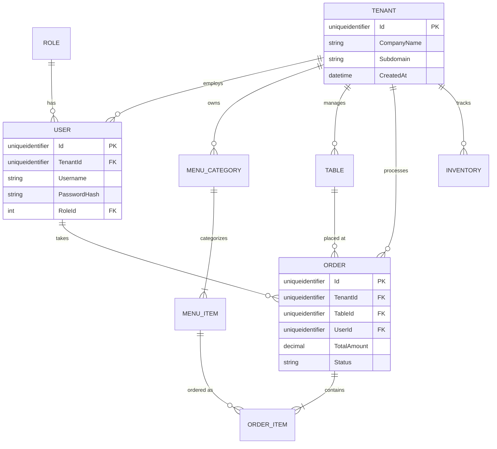
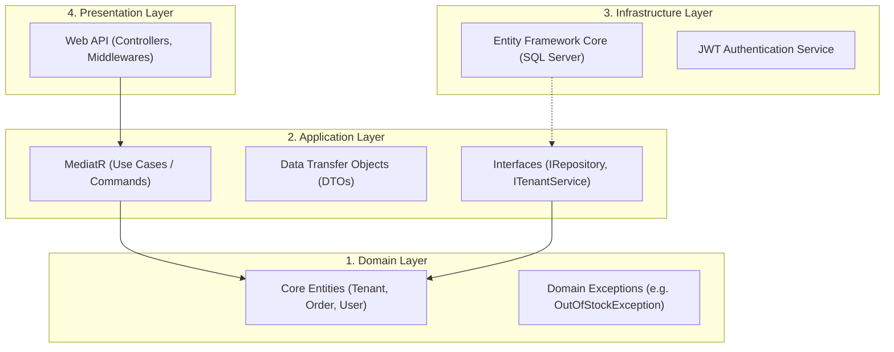

# Master Architecture Blueprint: Multi-Tenant Restaurant Management System (RMS)

This document is the ultimate A-to-Z blueprint for the RMS project. It strictly follows the required **Clean Architecture in C# .NET Core** and supports a **Multi-Tenant (Multiple Company) system**. It is designed to act as the single source of truth for the development team.

---

## 1. Multi-Tenant Database Design

To support multiple companies (tenants) from a single database without mixing their data, we use a **Database-Level Multi-Tenancy** approach (Row-Level Security). Every table belonging to a specific restaurant will have a `TenantId` (or `CompanyId`) column.

### 1.1 Complete ER Diagram



### 1.2 Data Dictionary (Table Schemas)

#### **1. Tenants (Companies)**
*The root table that identifies different restaurant businesses.*
| Column Name | Data Type | Constraints | Description |
| :--- | :--- | :--- | :--- |
| `Id` | `UNIQUEIDENTIFIER` | PK | Unique ID for the company |
| `CompanyName` | `NVARCHAR(100)` | NOT NULL | Name of the restaurant |
| `Subdomain` | `NVARCHAR(50)` | UNIQUE | Used to identify tenant from URL (e.g., `burgerking.rms.com`) |
| `CreatedAt` | `DATETIME2` | NOT NULL | Date the company registered |

#### **2. Users (Staff)**
*Employees belonging to a specific tenant.*
| Column Name | Data Type | Constraints | Description |
| :--- | :--- | :--- | :--- |
| `Id` | `UNIQUEIDENTIFIER` | PK | Unique ID |
| `TenantId` | `UNIQUEIDENTIFIER` | FK | Links user to their company |
| `RoleId` | `INT` | FK | Links to standard Roles (Admin, Waiter, Kitchen) |
| `Username` | `NVARCHAR(50)` | NOT NULL | Login name |
| `PasswordHash` | `NVARCHAR(MAX)` | NOT NULL | Encrypted password |

#### **3. MenuItems**
*Food and beverages sold by a tenant.*
| Column Name | Data Type | Constraints | Description |
| :--- | :--- | :--- | :--- |
| `Id` | `UNIQUEIDENTIFIER` | PK | Unique ID |
| `TenantId` | `UNIQUEIDENTIFIER` | FK | Links item to company |
| `Name` | `NVARCHAR(100)` | NOT NULL | E.g., "Cheeseburger" |
| `Price` | `DECIMAL(18,2)` | NOT NULL | Selling price |
| `IsAvailable` | `BIT` | NOT NULL | Can be disabled if out of stock |

#### **4. Orders**
*Customer orders placed at the restaurant.*
| Column Name | Data Type | Constraints | Description |
| :--- | :--- | :--- | :--- |
| `Id` | `UNIQUEIDENTIFIER` | PK | Unique ID |
| `TenantId` | `UNIQUEIDENTIFIER` | FK | Links order to company |
| `TableId` | `UNIQUEIDENTIFIER` | FK | Which table placed the order |
| `UserId` | `UNIQUEIDENTIFIER` | FK | Which waiter took the order |
| `TotalAmount` | `DECIMAL(18,2)` | NOT NULL | Final bill amount |
| `Status` | `INT` | NOT NULL | Enum: Open, Paid, Cancelled |

*(Similar structures apply to Tables, Categories, Inventory, etc. Every tenant-specific table MUST have `TenantId`)*

---

## 2. Clean Architecture Base Structure (.NET Core)

Clean Architecture ensures the **Domain Layer** is at the center and has zero dependencies on databases or UI frameworks. This makes testing and swapping technologies incredibly easy.

### 2.1 Conceptual Flow



### 2.2 Exact Visual Studio Solution Structure

When creating the project, the team should create a blank Solution (`RestaurantManagementSystem.sln`) and add four Class Libraries/Projects:

```text
RestaurantManagementSystem.sln
│
├── 1. RMS.Domain (Class Library)
│   ├── Common/              # Base Entity classes
│   ├── Entities/            # Tenant, User, Order, MenuItem, Table
│   ├── Enums/               # OrderStatus, RoleType
│   └── Exceptions/          # Domain-specific errors
│
├── 2. RMS.Application (Class Library)
│   ├── Interfaces/          # IApplicationDbContext, ICurrentUserService, ITenantService
│   ├── DTOs/                # OrderResponseDto, CreateUserRequestDto
│   ├── Features/            # CQRS Pattern (Organized by feature)
│   │   ├── Orders/          # Commands (CreateOrder) & Queries (GetOrders)
│   │   └── Menu/            # Commands (AddMenuItem)
│   └── Behaviors/           # MediatR validation pipeline behaviors
│
├── 3. RMS.Infrastructure (Class Library)
│   ├── Persistence/         # ApplicationDbContext, Migrations
│   │   └── Configurations/  # FluentAPI Entity configurations
│   ├── Services/            # TenantResolutionService (Reads TenantId from JWT/Header)
│   └── Authentication/      # JwtTokenGenerator setup
│
└── 4. RMS.Api (Web API Project - Startup)
    ├── Controllers/         # API Endpoints (e.g. OrdersController)
    ├── Middlewares/         # Global Exception Handling, Tenant Middleware
    ├── Program.cs           # Dependency Injection setup
    └── appsettings.json     # DB Connection Strings
```

---

## 3. Multi-Tenant Implementation Strategy (How it works in code)

To ensure Restaurant A NEVER sees Restaurant B's data, we implement **EF Core Global Query Filters**.

1. **The Request:** When a user logs in, the API returns a JWT Token. This token contains their `TenantId`.
2. **The Middleware:** On every API request, the `TenantResolutionService` extracts the `TenantId` from the JWT token and saves it in memory for the current request.
3. **The Database (Magic):** In the `ApplicationDbContext`, we apply a global filter to every entity that implements an `ITenantEntity` interface:
   ```csharp
   protected override void OnModelCreating(ModelBuilder builder)
   {
       // Automatically filter all queries so users only see their company's data
       builder.Entity<Order>().HasQueryFilter(e => e.TenantId == _tenantService.TenantId);
       builder.Entity<MenuItem>().HasQueryFilter(e => e.TenantId == _tenantService.TenantId);
   }
   ```
   **Result:** Developers don't need to manually write `WHERE TenantId = X` in their queries. EF Core does it automatically.

---

## 4. Step-by-Step Implementation Roadmap

Follow this exact roadmap so the team doesn't get lost. 

### **Phase 1: Foundation (The Base Structure)**
1. Create the 4 projects in Visual Studio (`Domain`, `Application`, `Infrastructure`, `Api`).
2. Set up Project References (Api -> Infrastructure & Application. Infrastructure -> Application. Application -> Domain).
3. Create the Domain Entities with `TenantId` properties.

### **Phase 2: Database & Multi-Tenancy**
1. Set up `ApplicationDbContext` in Infrastructure.
2. Implement the `ITenantService` and the EF Core Global Query Filters.
3. Generate the first Entity Framework Migration and update the SQL Server database.

### **Phase 3: Authentication & Security**
1. Implement ASP.NET Core Identity for users.
2. Build the Login endpoint to generate JWT Tokens (ensuring `TenantId` and `Role` are inside the token payload).
3. Test that multi-tenancy works: Login as Restaurant A, create an item. Login as Restaurant B, verify you cannot see Restaurant A's item.

### **Phase 4: Core Business Logic (CQRS)**
1. Build the **Menu Module** (Create/Read/Update Menu Items).
2. Build the **Table Management Module** (Add tables, change status).
3. Build the **POS Order Module** (The most complex part: Creating an Order, linking Order Items, calculating totals).

### **Phase 5: Frontend Integration**
1. Connect the chosen frontend (Blazor, React, or WPF) to the API endpoints.
2. Build the POS Interface, Kitchen Display System (KDS), and Admin Dashboards.
