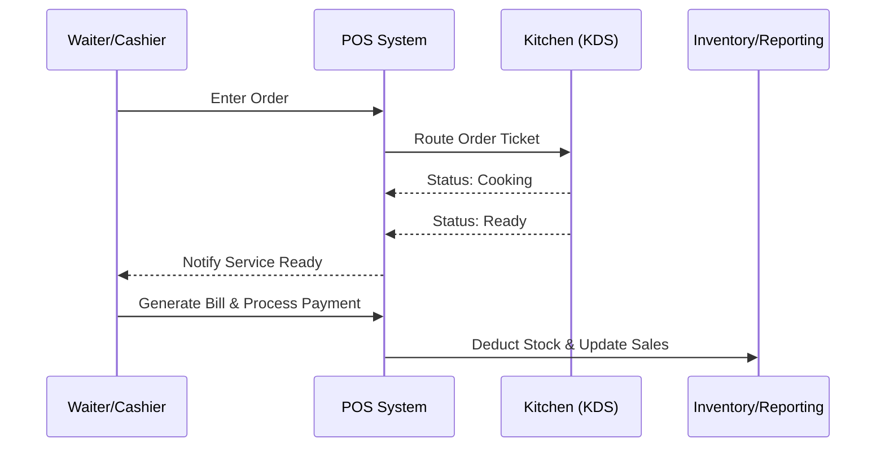
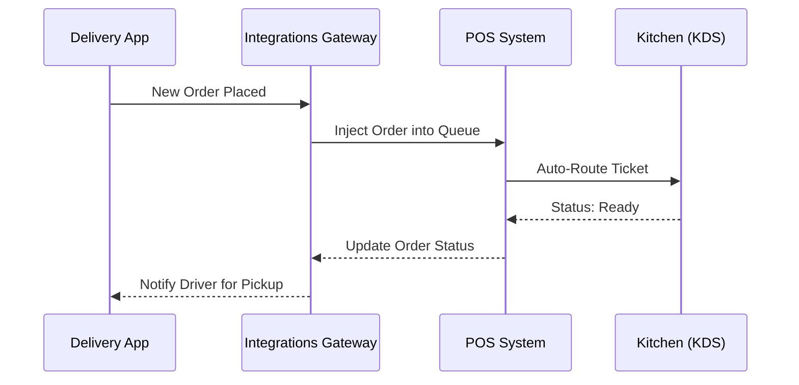
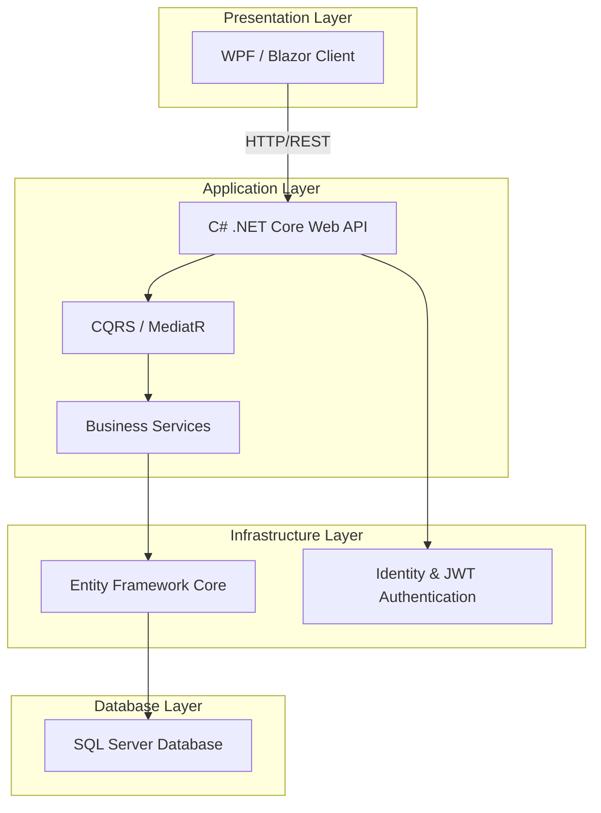
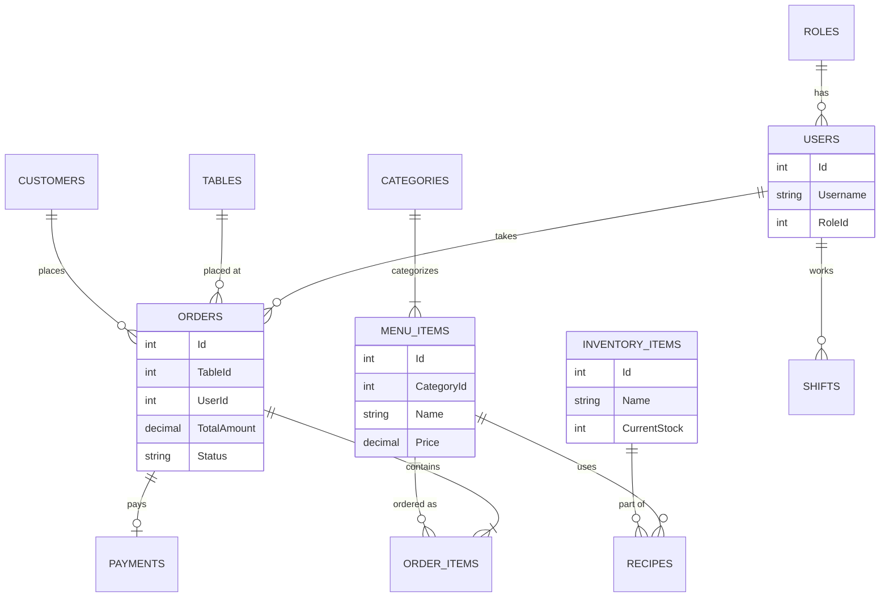

# Restaurant Management System with POS

## 1. Project Requirements Analysis

### Functional Requirements
- **User Management:** Secure authentication and role-based authorization (Admin, Manager, Cashier, Waiter, Kitchen Staff).
- **Point of Sale (POS):** Order entry, split billing, discount/coupon application, custom tipping, and receipt generation.
- **Inventory Management:** Real-time stock tracking, low stock alerts, supplier management, and purchase order generation.
- **Menu Management:** Dynamic management of categories, items, variations (sizes/addons), pricing, and availability status.
- **Table Management:** Visual floor plan with real-time table status (Available, Occupied, Reserved) and reservation management.
- **Kitchen Display System (KDS):** Digital order routing, ticket timers, and status updates (Pending, Cooking, Ready).
- **Reporting & Analytics:** Comprehensive dashboards for sales reports, tax reports, inventory consumption, and employee shift performance.
- **Shift & Cash Management:** Employee clock-in/out for payroll tracking, cash register float management, and end-of-day Z-Reports.
- **CRM & Loyalty Programs:** Customer profiles tracking order history, preferences, and a points-based loyalty reward system.
- **Third-Party Integrations:** API gateway for automatic synchronization of orders from delivery platforms (e.g., UberEats, DoorDash).

### Non-Functional Requirements
- **Performance:** High responsiveness with fast transaction processing, especially in the POS module during peak hours.
- **Security:** Data encryption at rest and in transit, strict role-based access control (RBAC), and PCI-DSS compliance for payment gateway integration.
- **Reliability:** Offline-First Architecture for the POS module utilizing a local database (e.g., SQLite) to cache transactions, automatically syncing with the central SQL Server when the internet connection is restored, plus automated daily data backups.
- **Hardware Integration:** Support for standard POS hardware including ESC/POS receipt printers, cash drawer kicks, barcode scanners, and EMV payment terminals.
- **Scalability:** Modular architecture to support scaling to multiple branches or franchise locations in the future.
- **Technology Stack:** C# .NET Core (Backend/API), WPF or Blazor/React (Frontend), SQL Server (Database), Entity Framework Core (ORM).

---

## 2. System Modules and Workflow

### Core Modules
1. **Admin/Management Portal:** Back-office application for configuring business settings, viewing financial reports, and managing employees.
2. **POS Terminal:** The front-of-house application used by cashiers and waiters to quickly take orders and process payments.
3. **Kitchen Display System (KDS):** A specialized view for kitchen staff to manage food preparation queues efficiently.
4. **Inventory Module:** Tracks ingredients and stock levels, deducting quantities automatically based on sold menu items.
5. **Integrations Gateway:** A background service managing communication with third-party delivery services, accounting software (e.g., QuickBooks/Xero), and payment gateways.

### Standard Workflow: Order to Payment
1. **Order Entry:** Waiter takes the customer's order via a mobile tablet, or a cashier enters it directly at the stationary POS terminal.
2. **Order Routing:** The system automatically splits and routes the order (e.g., food items to the Kitchen KDS, drinks to the Bar KDS).
3. **Preparation:** Kitchen staff view the ticket on the KDS. They mark items as 'Cooking', and once done, mark them as 'Ready'.
4. **Service Notification:** The system alerts the waiter that the order is ready to be served.
5. **Billing & Checkout:** The cashier or waiter generates the final bill, applies any relevant discounts, and processes the payment (Cash, Credit Card, or Mobile Wallet).
6. **Post-Transaction Processing:** Inventory is automatically deducted based on predefined recipes, and sales data is updated in the reporting dashboard.



### Third-Party Delivery Workflow (e.g., UberEats, DoorDash)


---

## 3. System Architecture and Database Schema

### System Architecture
We will utilize a **Clean Architecture / N-Tier Architecture** pattern to ensure maintainability and separation of concerns:
- **Presentation Layer:** The user interface built with WPF (for a robust desktop POS) or Blazor (for a cross-platform web approach).
- **Application Layer:** Contains business logic, interfaces, and CQRS (Command Query Responsibility Segregation) patterns to handle commands (writes) and queries (reads) efficiently.
- **Infrastructure / Data Access Layer:** Implementation of repositories using Entity Framework Core to interact with the database.
- **Database Layer:** Microsoft SQL Server for robust, relational data storage.



### Offline-First Synchronization Architecture
```mermaid
graph LR
    subgraph POS Terminal (Local)
        App[POS Client]
        LocalDB[(SQLite Local DB)]
        SyncAgent[Sync Background Service]
    end
    
    subgraph Cloud Server (Central)
        API[Central API]
        CentralDB[(SQL Server Main DB)]
    end
    
    App -->|Read/Write Fast| LocalDB
    App -->|Online Queries| API
    LocalDB --- SyncAgent
    SyncAgent <-->|Internet Restored: Sync| API
    API --> CentralDB
```

### Core Database Schema

- **Users:** `Id`, `Username`, `PasswordHash`, `FullName`, `RoleId`, `IsActive`, `CreatedAt`
- **Roles:** `Id`, `RoleName` (Admin, Cashier, Kitchen, Waiter)
- **Categories:** `Id`, `Name`, `Description`, `DisplayOrder`
- **MenuItems:** `Id`, `CategoryId`, `Name`, `Price`, `Cost`, `ImageURL`, `IsAvailable`
- **Tables:** `Id`, `TableNumber`, `Capacity`, `Status` (Available, Occupied, Reserved)
- **Orders:** `Id`, `TableId`, `UserId` (Waiter), `OrderTime`, `Status` (Open, Paid, Cancelled), `TotalAmount`, `Tax`, `Discount`
- **OrderItems:** `Id`, `OrderId`, `MenuItemId`, `Quantity`, `UnitPrice`, `Subtotal`, `Notes`, `Status` (Pending, Cooking, Ready)
- **Payments:** `Id`, `OrderId`, `Amount`, `PaymentMethod` (Cash, Card), `TransactionReference`, `PaymentDate`
- **InventoryItems:** `Id`, `Name`, `UnitOfMeasure`, `CurrentStock`, `ReorderLevel`
- **Recipes (Mapping):** `Id`, `MenuItemId`, `InventoryItemId`, `QuantityUsed`
- **Customers (CRM):** `Id`, `FullName`, `PhoneNumber`, `Email`, `LoyaltyPoints`, `CreatedAt`
- **Shifts:** `Id`, `UserId`, `ClockInTime`, `ClockOutTime`, `StartingCash`, `EndingCash`



---

## 4. UI Wireframes and Project Plan

### Conceptual UI Wireframes

1. **POS Dashboard (Front of House):**
   - **Left Panel:** Grid of category buttons (e.g., Starters, Mains, Desserts, Beverages) with colorful icons.
   - **Center Panel:** Responsive grid of menu items corresponding to the selected category.
   - **Right Panel:** The active order ticket displaying selected items, quantities, and prices. Includes a summary section for Subtotal, Tax, Discount, and a prominent "Pay / Checkout" button.
   
2. **Kitchen Display System (KDS):**
   - **Kanban-style Grid:** Displaying active tickets in columns (Pending, In Progress, Ready).
   - **Ticket Details:** Each ticket prominently shows the Table Number, Waiter Name, Elapsed Time (color-coded red if delayed), and the list of items with special dietary notes.

3. **Admin Dashboard (Back Office):**
   - **Top Overview:** Key Performance Indicators (KPIs) like Today's Sales, Active Orders, and Low Stock Alerts.
   - **Sidebar Navigation:** Expandable menu for Reports, User Management, Menu Engineering, Inventory control, and System Settings.

### Agile Project Implementation Plan

- **Phase 1: Requirements & Architecture Design (Weeks 1-2)**
  - Finalize all stakeholder requirements.
  - Complete the database schema design and setup the SQL Server instance.
  - Create high-fidelity UI/UX mockups using Figma.

- **Phase 2: Core Setup & Back-Office Module (Weeks 3-4)**
  - Initialize the C# .NET Core solution.
  - Implement Entity Framework Core and database migrations.
  - Develop User authentication/authorization and Menu Management screens.

- **Phase 3: POS Terminal & Table Management (Weeks 5-7)**
  - Develop the primary POS interface.
  - Implement order processing logic (cart calculation, taxes, discounts).
  - Build the visual table management and reservation system.

- **Phase 4: Kitchen Display & Inventory Integration (Weeks 8-9)**
  - Build the KDS screen with real-time updates (using SignalR for Web Sockets).
  - Integrate recipe-based automatic inventory deduction.

- **Phase 5: Reporting, QA Testing & Deployment (Weeks 10-12)**
  - Implement advanced analytics and reporting dashboards.
  - Conduct rigorous QA testing including Unit, Integration, and User Acceptance Testing (UAT).
  - Finalize deployment to the production environment and conduct staff training.
