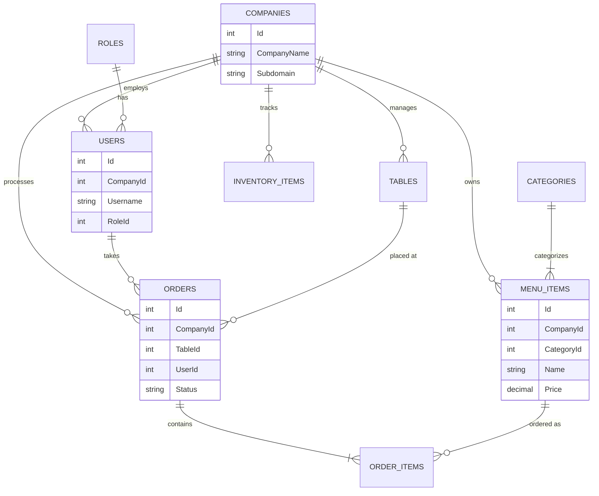
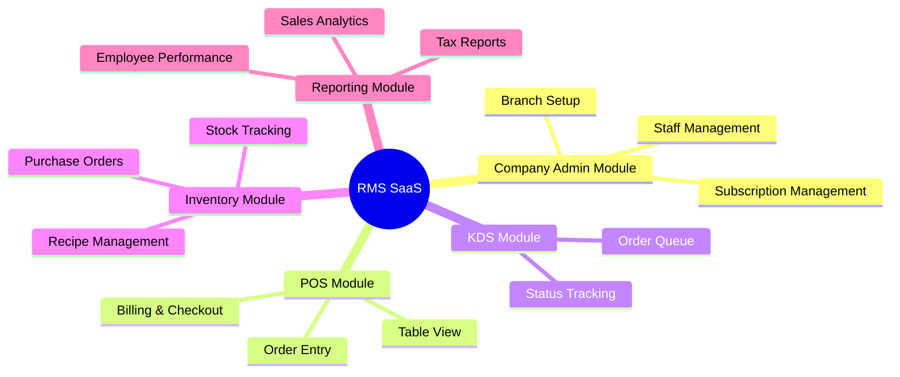

# Multi-Tenant Restaurant Management System (RMS)

## 1. Project Overview
This document outlines the architecture, database design, and module plan for a modern, scalable **Restaurant Management System (RMS)**. Based on academic and professional feedback, this project has been upgraded to support a **Multi-Tenant (Multiple Company Support) SaaS model**, built on a robust **Clean Architecture** using **C# .NET Core**.

### Core Enhancements
- **Clean Architecture:** Strict separation of concerns (Domain, Application, Infrastructure, Presentation) ensuring a highly testable and maintainable codebase.
- **Multi-Tenant System:** A single instance of the software serves multiple companies/restaurants independently, using `TenantId` (CompanyId) isolation at the database level.

---

## 2. Clean Architecture Base Structure

The system is designed using the Clean Architecture pattern. Dependencies flow inwards toward the Domain layer.

```mermaid
graph TD
    subgraph Presentation Layer
        UI["Web API (ASP.NET Core)"]
        Blazor["Blazor / React SPA"]
    end
    
    subgraph Infrastructure Layer
        EFCore["EF Core Repository"]
        Identity["Auth / Identity"]
        External["Third-Party Integrations"]
    end
    
    subgraph Application Layer
        CQRS["MediatR (Commands/Queries)"]
        Interfaces["Interfaces / DTOs"]
    end
    
    subgraph Domain Layer
        Entities["Core Entities (Models)"]
        Exceptions["Domain Exceptions"]
    end

    UI --> Application Layer
    Infrastructure Layer -.-> Application Layer
    Application Layer --> Domain Layer
```

### C# .NET Core Solution Folder Structure

```text
RestaurantManagementSystem.sln
├── 1. Domain (Core business logic, NO dependencies)
│   ├── Entities (Company, User, Order, MenuItem)
│   ├── Enums (OrderStatus, RoleType)
│   └── Exceptions
├── 2. Application (Use cases, interfaces, CQRS)
│   ├── Interfaces (IRepository, ITenantService)
│   ├── DTOs (Data Transfer Objects)
│   ├── Commands (CreateOrder, AddMenuItem)
│   └── Queries (GetOrdersByCompany)
├── 3. Infrastructure (External concerns, DB, Auth)
│   ├── Persistence (ApplicationDbContext, EF Core Configurations)
│   ├── Repositories (Repository implementations)
│   ├── Services (EmailService, TenantResolutionService)
│   └── Migrations
└── 4. Presentation (API Endpoints, UI)
    ├── Controllers (API Controllers)
    ├── Middlewares (TenantIdentifierMiddleware, ErrorHandling)
    └── Program.cs
```

---

## 3. Database Design (Multi-Tenant Schema)

To support multiple companies, every core table includes a `CompanyId` (Tenant ID). The database uses **Row-Level Security** or EF Core **Global Query Filters** (`HasQueryFilter(e => e.CompanyId == currentTenantId)`) to ensure data isolation.

### Core Entities

- **Companies (Tenants):** `Id`, `CompanyName`, `Subdomain`, `SubscriptionPlan`, `CreatedAt`
- **Users:** `Id`, `CompanyId`, `Username`, `PasswordHash`, `FullName`, `RoleId`, `IsActive`
- **Roles:** `Id`, `RoleName` (Admin, Cashier, Kitchen, Waiter)
- **Categories:** `Id`, `CompanyId`, `Name`, `Description`, `DisplayOrder`
- **MenuItems:** `Id`, `CompanyId`, `CategoryId`, `Name`, `Price`, `Cost`, `ImageURL`, `IsAvailable`
- **Tables:** `Id`, `CompanyId`, `TableNumber`, `Capacity`, `Status`
- **Orders:** `Id`, `CompanyId`, `TableId`, `UserId`, `OrderTime`, `Status`, `TotalAmount`
- **OrderItems:** `Id`, `OrderId`, `MenuItemId`, `Quantity`, `UnitPrice`, `Status` (Pending, Cooking, Ready)
- **InventoryItems:** `Id`, `CompanyId`, `Name`, `UnitOfMeasure`, `CurrentStock`, `ReorderLevel`

### Entity Relationship (ER) Diagram



---

## 4. Module and Sub-Module Plan

The system is logically divided into distinct modules.

### High-Level Module Visualization



### Detailed Sub-Module Breakdown

#### 1. Tenant/Company Admin Module (Super Admin & Company Admin)
- **Super Admin Sub-module:** Manage SaaS subscriptions, onboard new companies, system-wide metrics.
- **Company Profile Sub-module:** Configure tax rates, currency, receipt layouts, and business hours.
- **User & Role Sub-module:** Manage employees, assign roles (Cashier, Waiter, Kitchen), and configure role-based access control (RBAC).

#### 2. Point of Sale (POS) Module
- **Order Entry Sub-module:** Touch-friendly interface for item selection, applying variations/addons, and split billing.
- **Table Management Sub-module:** Visual floor plan showing real-time table statuses (Available, Occupied, Reserved).
- **Payment Sub-module:** Process cash, card, and mobile payments. Generate digital or printed receipts.

#### 3. Kitchen Display System (KDS) Module
- **Ticket Routing Sub-module:** Automatically route food items to kitchen screens and beverages to the bar.
- **Status Tracking Sub-module:** Allow kitchen staff to mark items as *Pending*, *Cooking*, or *Ready*.
- **Service Alerts:** Notify waitstaff via the POS or mobile devices when an order is ready for pickup.

#### 4. Inventory & Menu Management Module
- **Menu Engineering Sub-module:** Create categories, items, and dynamic pricing.
- **Stock Tracking Sub-module:** Real-time deduction of inventory based on sold items (using mapped recipes/ingredients).
- **Supplier & PO Sub-module:** Manage supplier details and generate Purchase Orders when stock hits the reorder level.

#### 5. Analytics & Reporting Module
- **Sales Dashboard:** Visual charts for daily/weekly/monthly revenue and top-selling items.
- **Operational Reports:** Inventory consumption reports, Z-Reports (End of Day), and tax summaries.

---

## 5. Technology Stack Summary

| Layer/Component | Technology |
| :--- | :--- |
| **Backend Framework** | C# .NET Core (Web API) |
| **Architecture** | Clean Architecture, CQRS (MediatR) |
| **Database** | Microsoft SQL Server |
| **ORM** | Entity Framework Core (EF Core) |
| **Authentication** | ASP.NET Core Identity & JWT |
| **Multi-Tenancy** | Database-level (TenantId column + EF Core Query Filters) |
| **Frontend Options** | Blazor WebAssembly / React.js / WPF (for offline POS terminal) |

