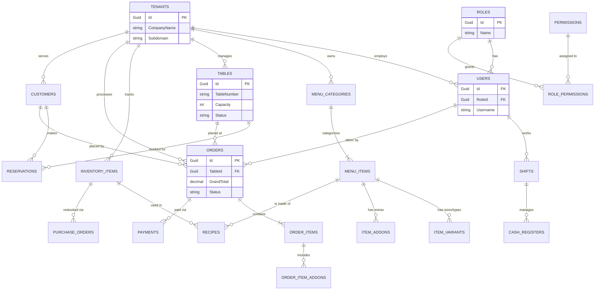

# Comprehensive RMS Database Schema & ERD
*Designed for a Multi-Tenant SaaS Restaurant Management System (RMS) with full POS capabilities.*

---

## 1. Complete Entity Relationship Diagram (ERD)

---

## 2. Table Schemas & Data Dictionary

### A. Core Multi-Tenancy & CRM
**`Tenants`** (The Companies/Restaurants)
- `Id` (GUID, PK)
- `CompanyName` (VARCHAR 100)
- `Subdomain` (VARCHAR 50, UNIQUE) - e.g., *kfc.rms.com*
- `Currency` (VARCHAR 10) - e.g., *USD, EUR*
- `DefaultTaxRate` (DECIMAL 5,2) - e.g., *15.00*
- `CreatedAt` (DATETIME)

**`Customers`** (Loyalty & CRM)
- `Id` (GUID, PK)
- `TenantId` (GUID, FK)
- `FullName` (VARCHAR 100)
- `Phone` (VARCHAR 20)
- `Email` (VARCHAR 100)
- `LoyaltyPoints` (INT)

### B. Users, Roles & Access Control
**`Roles`** (e.g., SuperAdmin, Manager, Cashier, Waiter, Kitchen)
- `Id` (GUID, PK)
- `TenantId` (GUID, FK, NULLABLE) - *Null means global role*
- `Name` (VARCHAR 50)

**`Permissions`** (System capabilities)
- `Id` (GUID, PK)
- `ActionName` (VARCHAR 100) - e.g., *CanVoidOrder, CanRefundPayment, CanEditMenu*

**`RolePermissions`** (Mapping Roles to Actions)
- `RoleId` (GUID, PK/FK)
- `PermissionId` (GUID, PK/FK)

**`Users`** (Staff Members)
- `Id` (GUID, PK)
- `TenantId` (GUID, FK)
- `RoleId` (GUID, FK)
- `FullName` (VARCHAR 100)
- `Passcode` (VARCHAR 10) - *For quick POS login via pin-pad*
- `PasswordHash` (VARCHAR 255) - *For web dashboard login*

### C. Shift & Cash Management (POS End-of-Day)
**`Shifts`**
- `Id` (GUID, PK)
- `TenantId` (GUID, FK)
- `UserId` (GUID, FK)
- `ClockInTime` (DATETIME)
- `ClockOutTime` (DATETIME, NULLABLE)
- `HourlyRate` (DECIMAL 18,2)

**`CashRegisters`** (Tracking the drawer)
- `Id` (GUID, PK)
- `TenantId` (GUID, FK)
- `UserId` (GUID, FK) - *Cashier on duty*
- `OpeningBalance` (DECIMAL 18,2) - *Float*
- `ClosingBalance` (DECIMAL 18,2) - *Z-Report total*
- `OpenedAt` (DATETIME)
- `ClosedAt` (DATETIME, NULLABLE)

### D. Advanced Menu Engine
**`MenuCategories`**
- `Id` (GUID, PK)
- `TenantId` (GUID, FK)
- `Name` (VARCHAR 50) - e.g., "Main Course", "Beverages"

**`MenuItems`**
- `Id` (GUID, PK)
- `TenantId` (GUID, FK)
- `CategoryId` (GUID, FK)
- `Name` (VARCHAR 100)
- `BasePrice` (DECIMAL 18,2)
- `IsAvailable` (BIT)

**`ItemVariants`** (e.g., Small, Medium, Large)
- `Id` (GUID, PK)
- `MenuItemId` (GUID, FK)
- `Name` (VARCHAR 50)
- `PriceAdjustment` (DECIMAL 18,2) - e.g., +$2.00

**`ItemAddons`** (e.g., Extra Cheese, No Onions)
- `Id` (GUID, PK)
- `MenuItemId` (GUID, FK)
- `Name` (VARCHAR 50)
- `Price` (DECIMAL 18,2)

### E. Tables & Reservations
**`Tables`** (Floor Plan)
- `Id` (GUID, PK)
- `TenantId` (GUID, FK)
- `TableNumber` (VARCHAR 10)
- `Capacity` (INT)
- `Status` (VARCHAR 20) - *Available, Occupied, Reserved*

**`Reservations`**
- `Id` (GUID, PK)
- `TenantId` (GUID, FK)
- `CustomerId` (GUID, FK)
- `TableId` (GUID, FK)
- `ReservationTime` (DATETIME)
- `PartySize` (INT)

### F. Orders & Checkout
**`Orders`** (The main ticket)
- `Id` (GUID, PK)
- `TenantId` (GUID, FK)
- `TableId` (GUID, FK, NULLABLE)
- `UserId` (GUID, FK) - *Waiter who took the order*
- `CustomerId` (GUID, FK, NULLABLE) - *For loyalty points*
- `OrderType` (VARCHAR 20) - *DineIn, Takeaway, Delivery*
- `SubTotal` (DECIMAL 18,2)
- `TaxAmount` (DECIMAL 18,2)
- `DiscountAmount` (DECIMAL 18,2)
- `GrandTotal` (DECIMAL 18,2)
- `Status` (VARCHAR 20) - *Open, Paid, Cancelled, Refunded*

**`OrderItems`** (Individual items on the ticket)
- `Id` (GUID, PK)
- `OrderId` (GUID, FK)
- `MenuItemId` (GUID, FK)
- `VariantId` (GUID, FK, NULLABLE)
- `Quantity` (INT)
- `UnitPrice` (DECIMAL 18,2)
- `KdsStatus` (VARCHAR 20) - *Pending, Cooking, Ready, Served* - **For Kitchen Display System**
- `Notes` (VARCHAR 255)

**`OrderItemAddons`** (Extras requested on the specific item)
- `Id` (GUID, PK)
- `OrderItemId` (GUID, FK)
- `AddonId` (GUID, FK)

**`Payments`**
- `Id` (GUID, PK)
- `OrderId` (GUID, FK)
- `Amount` (DECIMAL 18,2)
- `PaymentMethod` (VARCHAR 20) - *Cash, CreditCard, Mobile*
- `CashRegisterId` (GUID, FK) - *Ties payment to a specific shift's drawer*

### G. Inventory & Recipes
**`InventoryItems`** (Raw materials)
- `Id` (GUID, PK)
- `TenantId` (GUID, FK)
- `Name` (VARCHAR 100) - e.g., "Beef Patty"
- `CurrentStock` (DECIMAL 18,3)
- `UnitOfMeasure` (VARCHAR 20) - e.g., "Kg", "Pcs"
- `ReorderLevel` (DECIMAL 18,3) - *Triggers low stock alert*

**`Recipes`** (How menu items deplete inventory)
- `Id` (GUID, PK)
- `MenuItemId` (GUID, FK)
- `InventoryItemId` (GUID, FK)
- `QuantityUsed` (DECIMAL 18,3) - e.g., 0.2 (Kg of beef per burger)

**`PurchaseOrders`** (Restocking inventory)
- `Id` (GUID, PK)
- `TenantId` (GUID, FK)
- `SupplierName` (VARCHAR 100)
- `TotalCost` (DECIMAL 18,2)
- `Status` (VARCHAR 20) - *Pending, Received*
