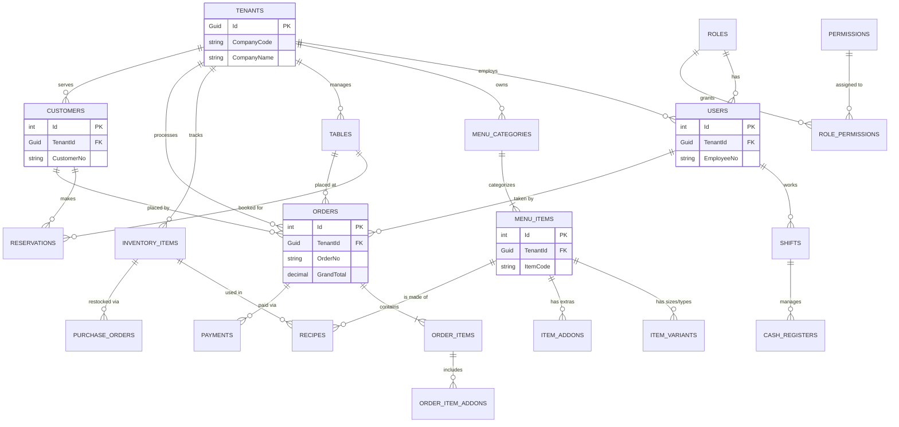

# Comprehensive RMS Database Schema & ERD
*Designed for a Multi-Tenant SaaS Restaurant Management System (RMS) with full POS capabilities.*

---

## 1. Complete Entity Relationship Diagram (ERD)

---

## 2. Table Schemas & Data Dictionary

### A. Core Multi-Tenancy & CRM
**`Tenants`** (The Companies/Restaurants - **Only table with a GUID Primary Key**)
- `Id` (GUID, PK)
- `CompanyCode` (VARCHAR 20, UNIQUE) - e.g., *COMP-001*
- `CompanyName` (VARCHAR 100)
- `Subdomain` (VARCHAR 50, UNIQUE) - e.g., *kfc.rms.com*
- `Currency` (VARCHAR 10) - e.g., *USD, EUR*
- `DefaultTaxRate` (DECIMAL 5,2) - e.g., *15.00*
- `CreatedAt` (DATETIME)

**`Customers`** (Loyalty & CRM)
- `Id` (INT, PK, IDENTITY)
- `TenantId` (GUID, FK)
- `CustomerNo` (VARCHAR 20, UNIQUE) - e.g., *CUST-10045*
- `FullName` (VARCHAR 100)
- `Phone` (VARCHAR 20)
- `Email` (VARCHAR 100)
- `LoyaltyPoints` (INT)

### B. Users, Roles & Access Control
**`Roles`**
- `Id` (INT, PK, IDENTITY)
- `TenantId` (GUID, FK, NULLABLE)
- `RoleCode` (VARCHAR 20) - e.g., *ROLE-ADMIN*
- `Name` (VARCHAR 50)

**`Permissions`**
- `Id` (INT, PK, IDENTITY)
- `PermissionCode` (VARCHAR 20) - e.g., *PERM-VOID*
- `ActionName` (VARCHAR 100)

**`RolePermissions`**
- `RoleId` (INT, PK/FK)
- `PermissionId` (INT, PK/FK)

**`Users`** (Staff Members)
- `Id` (INT, PK, IDENTITY)
- `TenantId` (GUID, FK)
- `RoleId` (INT, FK)
- `EmployeeNo` (VARCHAR 20, UNIQUE) - e.g., *EMP-102*
- `FullName` (VARCHAR 100)
- `Passcode` (VARCHAR 10) - *For quick POS login via pin-pad*
- `PasswordHash` (VARCHAR 255)

### C. Shift & Cash Management (POS End-of-Day)
**`Shifts`**
- `Id` (INT, PK, IDENTITY)
- `TenantId` (GUID, FK)
- `UserId` (INT, FK)
- `ShiftCode` (VARCHAR 20) - e.g., *SHF-20231015-01*
- `ClockInTime` (DATETIME)
- `ClockOutTime` (DATETIME, NULLABLE)
- `HourlyRate` (DECIMAL 18,2)

**`CashRegisters`**
- `Id` (INT, PK, IDENTITY)
- `TenantId` (GUID, FK)
- `UserId` (INT, FK)
- `RegisterCode` (VARCHAR 20) - e.g., *REG-01*
- `OpeningBalance` (DECIMAL 18,2)
- `ClosingBalance` (DECIMAL 18,2)
- `OpenedAt` (DATETIME)
- `ClosedAt` (DATETIME, NULLABLE)

### D. Advanced Menu Engine
**`MenuCategories`**
- `Id` (INT, PK, IDENTITY)
- `TenantId` (GUID, FK)
- `CategoryCode` (VARCHAR 20) - e.g., *CAT-BEV*
- `Name` (VARCHAR 50)

**`MenuItems`**
- `Id` (INT, PK, IDENTITY)
- `TenantId` (GUID, FK)
- `CategoryId` (INT, FK)
- `ItemCode` (VARCHAR 20, UNIQUE) - e.g., *MNU-BRG-01*
- `Name` (VARCHAR 100)
- `BasePrice` (DECIMAL 18,2)
- `IsAvailable` (BIT)

**`ItemVariants`**
- `Id` (INT, PK, IDENTITY)
- `MenuItemId` (INT, FK)
- `VariantCode` (VARCHAR 20) - e.g., *VAR-LRG*
- `Name` (VARCHAR 50)
- `PriceAdjustment` (DECIMAL 18,2)

**`ItemAddons`**
- `Id` (INT, PK, IDENTITY)
- `MenuItemId` (INT, FK)
- `AddonCode` (VARCHAR 20) - e.g., *ADD-CHS*
- `Name` (VARCHAR 50)
- `Price` (DECIMAL 18,2)

### E. Tables & Reservations
**`Tables`** (Floor Plan)
- `Id` (INT, PK, IDENTITY)
- `TenantId` (GUID, FK)
- `TableCode` (VARCHAR 20) - e.g., *TBL-A1*
- `TableNumber` (VARCHAR 10)
- `Capacity` (INT)
- `Status` (VARCHAR 20) - *Available, Occupied, Reserved*

**`Reservations`**
- `Id` (INT, PK, IDENTITY)
- `TenantId` (GUID, FK)
- `CustomerId` (INT, FK)
- `TableId` (INT, FK)
- `ReservationNo` (VARCHAR 20) - e.g., *RES-00921*
- `ReservationTime` (DATETIME)
- `PartySize` (INT)

### F. Orders & Checkout
**`Orders`** (The main ticket)
- `Id` (INT, PK, IDENTITY)
- `TenantId` (GUID, FK)
- `TableId` (INT, FK, NULLABLE)
- `UserId` (INT, FK)
- `CustomerId` (INT, FK, NULLABLE)
- `OrderNo` (VARCHAR 50, UNIQUE) - e.g., *ORD-2023-11204*
- `OrderType` (VARCHAR 20) - *DineIn, Takeaway, Delivery*
- `SubTotal` (DECIMAL 18,2)
- `TaxAmount` (DECIMAL 18,2)
- `DiscountAmount` (DECIMAL 18,2)
- `GrandTotal` (DECIMAL 18,2)
- `Status` (VARCHAR 20)

**`OrderItems`**
- `Id` (INT, PK, IDENTITY)
- `OrderId` (INT, FK)
- `MenuItemId` (INT, FK)
- `VariantId` (INT, FK, NULLABLE)
- `Quantity` (INT)
- `UnitPrice` (DECIMAL 18,2)
- `KdsStatus` (VARCHAR 20) - *Pending, Cooking, Ready, Served*
- `Notes` (VARCHAR 255)

**`OrderItemAddons`**
- `Id` (INT, PK, IDENTITY)
- `OrderItemId` (INT, FK)
- `AddonId` (INT, FK)

**`Payments`**
- `Id` (INT, PK, IDENTITY)
- `OrderId` (INT, FK)
- `CashRegisterId` (INT, FK)
- `PaymentNo` (VARCHAR 50) - e.g., *PAY-99382*
- `Amount` (DECIMAL 18,2)
- `PaymentMethod` (VARCHAR 20) - *Cash, CreditCard, Mobile*
- `TransactionId` (VARCHAR 100, NULLABLE)

### G. Inventory & Recipes
**`InventoryItems`**
- `Id` (INT, PK, IDENTITY)
- `TenantId` (GUID, FK)
- `ItemCode` (VARCHAR 20, UNIQUE) - e.g., *INV-BEEF-01*
- `Name` (VARCHAR 100)
- `CurrentStock` (DECIMAL 18,3)
- `UnitOfMeasure` (VARCHAR 20) - e.g., "Kg", "Pcs"
- `ReorderLevel` (DECIMAL 18,3)

**`Recipes`**
- `Id` (INT, PK, IDENTITY)
- `MenuItemId` (INT, FK)
- `InventoryItemId` (INT, FK)
- `QuantityUsed` (DECIMAL 18,3)

**`PurchaseOrders`**
- `Id` (INT, PK, IDENTITY)
- `TenantId` (GUID, FK)
- `PoNumber` (VARCHAR 50, UNIQUE) - e.g., *PO-2023-089*
- `SupplierName` (VARCHAR 100)
- `TotalCost` (DECIMAL 18,2)
- `Status` (VARCHAR 20) - *Pending, Received*
