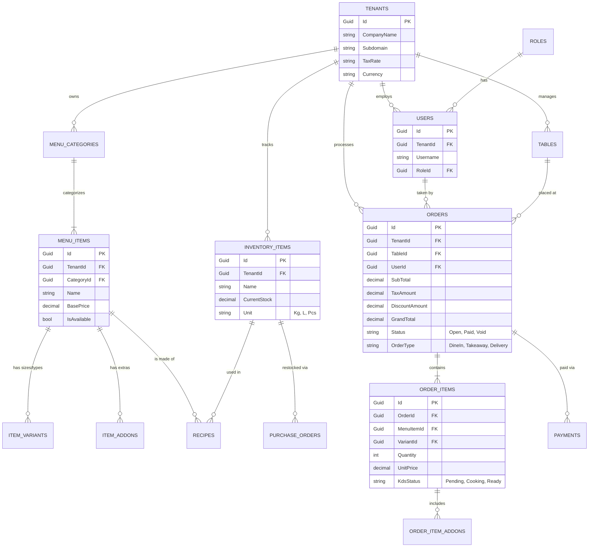

# Comprehensive RMS Database Schema & ERD
*Designed for a Multi-Tenant SaaS Restaurant Management System (RMS) with full POS capabilities.*

---

## 1. Complete Entity Relationship Diagram (ERD)

---

## 2. Table Schemas & Data Dictionary

### A. Core Multi-Tenancy
**`Tenants`** (The Companies/Restaurants)
- `Id` (GUID, PK)
- `CompanyName` (VARCHAR 100)
- `Subdomain` (VARCHAR 50, UNIQUE) - e.g., *kfc.rms.com*
- `Currency` (VARCHAR 10) - e.g., *USD, EUR*
- `DefaultTaxRate` (DECIMAL 5,2) - e.g., *15.00*
- `CreatedAt` (DATETIME)

### B. Users & Access
**`Users`** (Staff Members)
- `Id` (GUID, PK)
- `TenantId` (GUID, FK)
- `RoleId` (GUID, FK)
- `FullName` (VARCHAR 100)
- `Passcode` (VARCHAR 10) - *For quick POS login*
- `PasswordHash` (VARCHAR 255) - *For admin dashboard*

**`Roles`** (Admin, Manager, Cashier, Waiter, Kitchen)
- `Id` (GUID, PK)
- `Name` (VARCHAR 50)

### C. Advanced Menu (POS Form Factor)
**`MenuItems`**
- `Id` (GUID, PK)
- `TenantId` (GUID, FK)
- `CategoryId` (GUID, FK)
- `Name` (VARCHAR 100)
- `BasePrice` (DECIMAL 18,2)
- `IsAvailable` (BIT)

**`ItemVariants`** (e.g., Small, Medium, Large)
- `Id` (GUID, PK)
- `MenuItemId` (GUID, FK)
- `Name` (VARCHAR 50) - e.g., "Large"
- `PriceAdjustment` (DECIMAL 18,2) - e.g., +$2.00

**`ItemAddons`** (e.g., Extra Cheese, No Onions)
- `Id` (GUID, PK)
- `MenuItemId` (GUID, FK)
- `Name` (VARCHAR 50)
- `Price` (DECIMAL 18,2)

### D. Orders & Checkout
**`Orders`** (The main ticket)
- `Id` (GUID, PK)
- `TenantId` (GUID, FK)
- `TableId` (GUID, FK, NULLABLE)
- `UserId` (GUID, FK) - *Who opened the ticket*
- `OrderType` (VARCHAR 20) - *DineIn, Takeaway, Delivery*
- `SubTotal` (DECIMAL 18,2)
- `TaxAmount` (DECIMAL 18,2)
- `DiscountAmount` (DECIMAL 18,2)
- `GrandTotal` (DECIMAL 18,2)
- `Status` (VARCHAR 20) - *Open, Paid, Cancelled, Refunded*
- `CreatedAt` (DATETIME)

**`OrderItems`** (Individual items on the ticket)
- `Id` (GUID, PK)
- `OrderId` (GUID, FK)
- `MenuItemId` (GUID, FK)
- `VariantId` (GUID, FK, NULLABLE)
- `Quantity` (INT)
- `UnitPrice` (DECIMAL 18,2)
- `KdsStatus` (VARCHAR 20) - *Pending, Cooking, Ready, Served* - **Critical for Kitchen Display System**
- `Notes` (VARCHAR 255) - e.g., "Allergy to peanuts"

**`OrderItemAddons`** (Extras requested on the specific item)
- `Id` (GUID, PK)
- `OrderItemId` (GUID, FK)
- `AddonId` (GUID, FK)

**`Payments`**
- `Id` (GUID, PK)
- `OrderId` (GUID, FK)
- `Amount` (DECIMAL 18,2)
- `PaymentMethod` (VARCHAR 20) - *Cash, CreditCard, Mobile*
- `TransactionId` (VARCHAR 100, NULLABLE) - *For card terminals*

### E. Inventory & Recipes
**`InventoryItems`** (Raw materials)
- `Id` (GUID, PK)
- `TenantId` (GUID, FK)
- `Name` (VARCHAR 100) - e.g., "Beef Patty"
- `CurrentStock` (DECIMAL 18,3)
- `UnitOfMeasure` (VARCHAR 20) - e.g., "Kg", "Pcs"
- `ReorderLevel` (DECIMAL 18,3) - *Triggers low stock alert*

**`Recipes`** (How menu items deplete inventory)
- `Id` (GUID, PK)
- `MenuItemId` (GUID, FK)
- `InventoryItemId` (GUID, FK)
- `QuantityUsed` (DECIMAL 18,3) - e.g., 0.2 (Kg of beef per burger)
