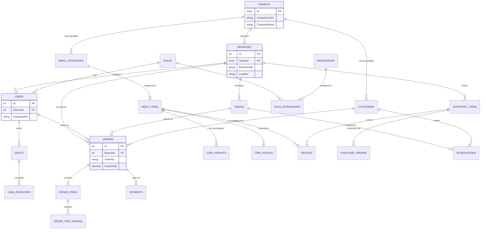

# Comprehensive RMS Database Schema & ERD (Version 2)
*Enterprise SaaS Architecture with Multi-Tenant & Multi-Branch Support*

---

## 1. Complete Entity Relationship Diagram (ERD)

---

## 2. Table Schemas & Data Dictionary

### A. Core SaaS Architecture (Multi-Tenant & Multi-Branch)
**`Tenants`** (The Global Company - **Only table with a GUID Primary Key**)
- `Id` (GUID, PK)
- `CompanyCode` (VARCHAR 20, UNIQUE) - e.g., *COMP-001*
- `CompanyName` (VARCHAR 100)
- `Subdomain` (VARCHAR 50, UNIQUE) - e.g., *kfc.rms.com*
- `CreatedAt` (DATETIME)

**`Branches`** (Physical Locations)
- `Id` (INT, PK, IDENTITY)
- `TenantId` (GUID, FK)
- `BranchCode` (VARCHAR 20, UNIQUE) - e.g., *BRN-DHAKA-01*
- `Name` (VARCHAR 100)
- `Address` (VARCHAR 255)
- `ContactPhone` (VARCHAR 20)

**`Customers`** (Loyalty & CRM - Shared globally across branches)
- `Id` (INT, PK, IDENTITY)
- `TenantId` (GUID, FK)
- `CustomerNo` (VARCHAR 20, UNIQUE) - e.g., *CUST-10045*
- `FullName` (VARCHAR 100)
- `Phone` (VARCHAR 20)
- `LoyaltyPoints` (INT)

### B. Users, Roles & Access Control
**`Roles`**
- `Id` (INT, PK, IDENTITY)
- `TenantId` (GUID, FK, NULLABLE)
- `RoleCode` (VARCHAR 20) - e.g., *ROLE-ADMIN*
- `Name` (VARCHAR 50)

**`Permissions`**
- `Id` (INT, PK, IDENTITY)
- `PermissionCode` (VARCHAR 20) - e.g., *PERM-VOID*
- `ActionName` (VARCHAR 100)

**`RolePermissions`**
- `RoleId` (INT, PK/FK)
- `PermissionId` (INT, PK/FK)

**`Users`** (Staff Members assigned to a Branch)
- `Id` (INT, PK, IDENTITY)
- `BranchId` (INT, FK)
- `RoleId` (INT, FK)
- `EmployeeNo` (VARCHAR 20, UNIQUE) - e.g., *EMP-102*
- `FullName` (VARCHAR 100)
- `Passcode` (VARCHAR 10) - *For quick POS login via pin-pad*
- `PasswordHash` (VARCHAR 255)

### C. Shift & Cash Management (POS End-of-Day)
**`Shifts`**
- `Id` (INT, PK, IDENTITY)
- `BranchId` (INT, FK)
- `UserId` (INT, FK)
- `ShiftCode` (VARCHAR 20) - e.g., *SHF-20231015-01*
- `ClockInTime` (DATETIME)
- `ClockOutTime` (DATETIME, NULLABLE)

**`CashRegisters`**
- `Id` (INT, PK, IDENTITY)
- `BranchId` (INT, FK)
- `UserId` (INT, FK)
- `RegisterCode` (VARCHAR 20) - e.g., *REG-01*
- `OpeningBalance` (DECIMAL 18,2)
- `ClosingBalance` (DECIMAL 18,2)
- `OpenedAt` (DATETIME)

### D. Advanced Menu Engine
**`MenuCategories`** (Shared globally across Tenant)
- `Id` (INT, PK, IDENTITY)
- `TenantId` (GUID, FK)
- `CategoryCode` (VARCHAR 20)
- `Name` (VARCHAR 50)

**`MenuItems`**
- `Id` (INT, PK, IDENTITY)
- `TenantId` (GUID, FK)
- `CategoryId` (INT, FK)
- `ItemCode` (VARCHAR 20, UNIQUE)
- `Name` (VARCHAR 100)
- `BasePrice` (DECIMAL 18,2)
- `IsAvailable` (BIT)

**`ItemVariants`**
- `Id` (INT, PK, IDENTITY)
- `MenuItemId` (INT, FK)
- `VariantCode` (VARCHAR 20)
- `Name` (VARCHAR 50)
- `PriceAdjustment` (DECIMAL 18,2)

**`ItemAddons`**
- `Id` (INT, PK, IDENTITY)
- `MenuItemId` (INT, FK)
- `AddonCode` (VARCHAR 20)
- `Name` (VARCHAR 50)
- `Price` (DECIMAL 18,2)

### E. Tables & Reservations
**`Tables`** (Floor Plan per Branch)
- `Id` (INT, PK, IDENTITY)
- `BranchId` (INT, FK)
- `TableCode` (VARCHAR 20)
- `Capacity` (INT)
- `Status` (VARCHAR 20)

**`Reservations`**
- `Id` (INT, PK, IDENTITY)
- `BranchId` (INT, FK)
- `CustomerId` (INT, FK)
- `TableId` (INT, FK)
- `ReservationNo` (VARCHAR 20)
- `ReservationTime` (DATETIME)

### F. Orders & Checkout
**`Orders`** (The main ticket per Branch)
- `Id` (INT, PK, IDENTITY)
- `BranchId` (INT, FK)
- `TableId` (INT, FK, NULLABLE)
- `UserId` (INT, FK)
- `CustomerId` (INT, FK, NULLABLE)
- `OrderNo` (VARCHAR 50, UNIQUE)
- `OrderType` (VARCHAR 20) - *DineIn, Takeaway, Delivery*
- `GrandTotal` (DECIMAL 18,2)
- `Status` (VARCHAR 20)

**`OrderItems`**
- `Id` (INT, PK, IDENTITY)
- `OrderId` (INT, FK)
- `MenuItemId` (INT, FK)
- `VariantId` (INT, FK, NULLABLE)
- `Quantity` (INT)
- `UnitPrice` (DECIMAL 18,2)
- `KdsStatus` (VARCHAR 20) - *Pending, Cooking, Ready, Served*

**`OrderItemAddons`**
- `Id` (INT, PK, IDENTITY)
- `OrderItemId` (INT, FK)
- `AddonId` (INT, FK)

**`Payments`**
- `Id` (INT, PK, IDENTITY)
- `OrderId` (INT, FK)
- `CashRegisterId` (INT, FK)
- `PaymentNo` (VARCHAR 50)
- `Amount` (DECIMAL 18,2)
- `PaymentMethod` (VARCHAR 20) - *Cash, CreditCard*

### G. Inventory & Recipes
**`InventoryItems`** (Tracked per Branch)
- `Id` (INT, PK, IDENTITY)
- `BranchId` (INT, FK)
- `ItemCode` (VARCHAR 20, UNIQUE)
- `Name` (VARCHAR 100)
- `CurrentStock` (DECIMAL 18,3)
- `UnitOfMeasure` (VARCHAR 20)
- `ReorderLevel` (DECIMAL 18,3)

**`Recipes`**
- `Id` (INT, PK, IDENTITY)
- `MenuItemId` (INT, FK)
- `InventoryItemId` (INT, FK)
- `QuantityUsed` (DECIMAL 18,3)

**`PurchaseOrders`**
- `Id` (INT, PK, IDENTITY)
- `BranchId` (INT, FK)
- `PoNumber` (VARCHAR 50, UNIQUE)
- `SupplierName` (VARCHAR 100)
- `TotalCost` (DECIMAL 18,2)
- `Status` (VARCHAR 20)
